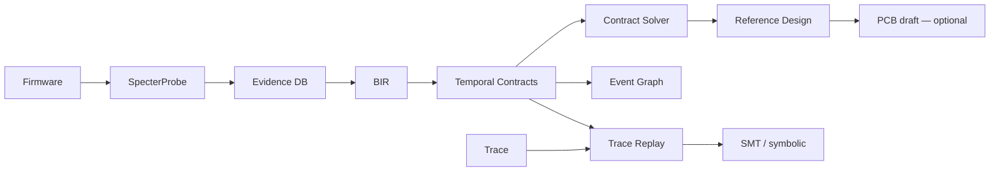

# B.A.S.E. — Behavioral ASIC Synthesis Engine

[](https://github.com/Eternet-Mycelium-Network/B.A.S.E./actions/workflows/ci.yml)
[](LICENSE.md)

> *"O que este hardware faz?" em vez de "Como este hardware foi implementado?"*

**Motor de engenharia reversa comportamental assistida** — evidência → contratos → Reference Design.

> **v0.2 em construção** ([Path to Real](base-vault/12%20-%20Path%20to%20Real/12.00%20-%20Index.md)):
> análise auditável + design de referência. **Não** é (ainda) gerador de PCB fabricável nem substituto drop-in de ASIC.

---

## O que funciona hoje

Fonte da verdade: vault Obsidian → [**Maturity Matrix**](base-vault/12%20-%20Path%20to%20Real/12.02%20-%20Maturity%20Matrix.md)

| Área | Estado |
|------|--------|
| `analyze` + Evidence DB + `--disasm` / `--mmio-traces` | Útil no wedge ARM |
| `design` / `synth` + component DB + contratos | Funcional; depende da qualidade do spec |
| `replay` / `prove` (simbólico) / `event-graph` / `bir` | Auditável com fixtures |
| `fw` | Skeleton **host-testable** (`make host`) — não firmware de produção |
| `pcb` | **Engineering draft** KiCad — *not fabricable* |
| `evolve` / pipeline completa “ASIC pronto” | Experimental / overclaim — evitar |

Plano de execução: [Master Plan](base-vault/12%20-%20Path%20to%20Real/12.01%20-%20Master%20Plan.md) · [Sprint Board](base-vault/12%20-%20Path%20to%20Real/12.04%20-%20Sprint%20Board.md)

---

## Pipeline (alvo)

```text
Firmware → analyze → Evidence DB → BIR → Contracts → Solver → Reference Design
                                                              ↓
                                                    [PCB/FW draft — opcional]
```

---

## Quick Start

```bash
git clone https://github.com/Eternet-Mycelium-Network/B.A.S.E..git
cd B.A.S.E.
cargo build -p base-cli
```

### Piloto (fixtures — start here)

```bash
# Ver examples/pilot/README.md
cargo build -p base-cli
./target/debug/base analyze examples/pilot/fw.bin \
  --mmio-traces examples/pilot/mmio.json --classify uart \
  -o examples/pilot/out/analyze
./target/debug/base design examples/pilot/out/analyze/hardware_spec.yaml \
  -o examples/pilot/out/design
./target/debug/base prove examples/pilot/contracts.yaml \
  -o examples/pilot/out/prove
./target/debug/base replay examples/pilot/trace.csv \
  --contracts examples/pilot/contracts.yaml \
  -o examples/pilot/out/violations.json
```

### Análise

```bash
base analyze firmware.bin --disasm --dot -o output/
# → hardware_spec.yaml + evidence_db.yaml (+ DOT se --dot)
```

### Reference Design (saída principal)

```bash
base design output/hardware_spec.yaml -o output/design/
# → reference_design.yaml (engineering draft de arquitetura)
```

### Replay / prova

```bash
base replay trace.csv --contracts contracts.yaml -o violations.json
base prove contracts.yaml -o proof/   # simbólico; Z3 via --features solver_z3
```

---

## Arquitetura



### Tensão Ψ

```text
Ψ(B, H) = ∫ δ(ω_obs, ω_H) dμ
confidence = max(0, 1 - Ψ/(1+Ψ))
```

---

## CLI

| Comando | Notas |
|---------|-------|
| `analyze` | HardwareSpec + Evidence DB |
| `synth` / `design` | Mapping + Reference Design |
| `replay` / `prove` / `event-graph` | Contratos temporais |
| `bir` | Validate / compile BSL / export |
| `fw` | Draft C + `make host` |
| `pcb` | Draft KiCad (experimental) |
| `check` / `evolve` / `pipeline` / `reconstruct` | Ver Maturity Matrix |

---

## Mercados (realista)

| Mercado | Papel v0.2 |
|---------|------------|
| Forense / segurança | **Wedge principal** — Evidence + contratos + design |
| Educação / pesquisa | Pipeline visual + Ψ |
| Preservação industrial | Consultoria humana + tool assist — não turnkey |
| SaaS PME | Depois do piloto Path to Real (R6) |

Detalhes: [`COMMERCIAL.md`](COMMERCIAL.md).

---

## Licença

AGPLv3 — [LICENSE.md](LICENSE.md)

Uso proprietário sem compartilhar modificações: licença comercial disponível.
