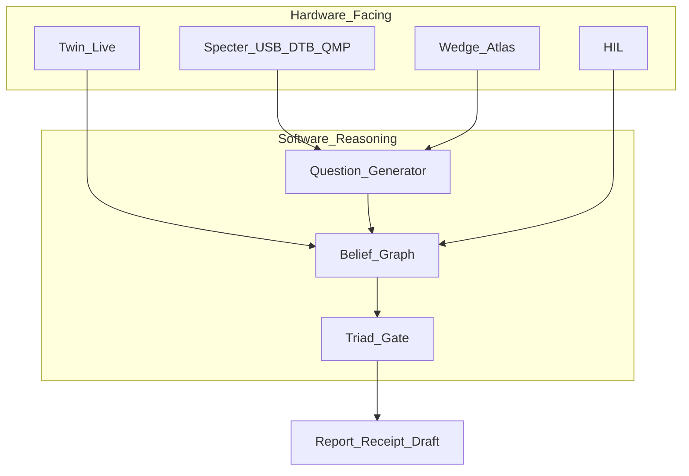

# B.A.S.E. — Behavioral ASIC Synthesis Engine

[](https://github.com/bmcc-DEV/B.A.S.E./actions/workflows/ci.yml)
[](https://github.com/bmcc-DEV/B.A.S.E./actions/workflows/formal.yml)
[](LICENSE.md)
[](https://github.com/bmcc-DEV/B.A.S.E./releases/tag/v1.1.0-rc)

> *"O que este hardware faz?" em vez de "Como este hardware foi implementado?"*

**Plataforma de engenharia reversa automatizada assistida por evidência** — percepção HW + raciocínio SW (QRM / belief / triad).

> **Honesty:** `generates_os: false` · `auto_fix_complete: false` · flash = lab assist / manual  
> **Tag [`v1.6.3-rc`](https://github.com/bmcc-DEV/B.A.S.E./releases/tag/v1.6.3-rc)** · Twin/Live · G35 wedge · [CHANGELOG](CHANGELOG.md) · [Platform RE](docs/PLATFORM_RE.md)
>
> ≠ OS turnkey · ≠ PCB fabricável · ≠ HIL production · ≠ Transformer / “RE mágica”

---

## Divisão HW / SW

| Lado | Papel | Crates |
|------|--------|--------|
| **Hardware-facing** | Aquisição de evidência imutável | `specterprobe`, `base-virt` (QMP/Live), `base-port` (USB×DT/wedge), `base-hil`, `base-core` evidence |
| **Software reasoning** | Perguntas → crenças → hipóteses → triad | **`base-reason`** |

Loop: **observar → perguntar → hipotetizar → lab/receipt → strengthen/forget**.

---

## O que funciona hoje

Fonte da verdade: [**Maturity Matrix**](base-vault/12%20-%20Path%20to%20Real/12.02%20-%20Maturity%20Matrix.md)

### CLI / pipeline

| Área | Estado |
|------|--------|
| `analyze` / `design` / `synth` / `replay` / `prove` / `bir` / `check` / `pipeline` | **REAL\*** no wedge |
| `study` (Specter VM Forth + Lua) | **REAL\*** — loop autónomo; `auto_fix_complete=false` |
| `reconstruct` | **REAL\*** — `stop_reason`; ≠ auto-fix |
| `reason` | **REAL\*** — QRM/belief/triad sobre atlas/sinais; ≠ Transformer |
| `port` (package / usb-probe / wedge / clocks-pinctrl) | **EXPERIMENTAL** — mapa/fósseis/atlas; ≠ OS rewrite |
| `virt` (Specter Live / QMP / twin) | **EXPERIMENTAL** — ≠ OS turnkey |
| `evolve` / `fw` / `pcb` | **REAL\*** drafts; PCB `NOT FABRICABLE` |
| `hil` | **REAL\*** host + Gate A; production gated |

### Wedges / smokes

| Wedge | Smoke |
|-------|-------|
| RP UART / SPI | `run.sh` / `run_t1_b2.sh` |
| STM32 USART/SPI/I2C/TIM/triple | `pilot_stm32/run*.sh` |
| Specter study | `examples/pilot_study/run_study.sh` |
| Moto G35 Path A + reason | `run_path_a.sh` · `base reason g35` · [REASONING](examples/pilot_moto_g35/REASONING.md) |
| Moto G35 wedge P0 | `run_wedge_pipeline.sh` · [WEDGE_HANDOFF](examples/pilot_moto_g35/WEDGE_HANDOFF.md) |
| iMac G3 OS-port A | `examples/pilot_imac_g3/run.sh` |

---

## Pipeline

```text
Firmware / USB / DTB / QMP
        ↓
   Hardware-facing (Specter · wedge · twin)
        ↓
   Evidence DB → BIR → Contracts → Solver → Reference Design
        ↓
   base-reason (QRM · belief · triad) → report / receipt draft
        ↓
   study / reconstruct / [PCB·FW draft opcional]
```

---

## Quick Start

```bash
git clone https://github.com/bmcc-DEV/B.A.S.E..git
cd B.A.S.E.
cargo build -p base-cli

./examples/pilot/run.sh
./examples/pilot_study/run_study.sh
./examples/pilot_moto_g35/run_wedge_pipeline.sh
```

### Reason (G35)

```bash
cargo build -p base-cli
./target/debug/base reason g35 -o output/reason_g35
# → reason_report.md · reason_receipt_draft.json (flashed: false)
```

### Specter study

```bash
base study path/to/hardware_spec.yaml \
  --policy examples/pilot_study/policy.lua \
  --program examples/pilot_study/study.base \
  -o out/study/
```

### Análise / HIL

```bash
base analyze firmware.bin --mmio-traces mmio.json --classify uart -o output/
base hil enumerate -o /tmp/hil/
base hil flash /tmp/x.bin --mock-flash -o /tmp/hil/
```

---

## Arquitectura



### Tensão Ψ

```text
Ψ(B, H) = ∫ δ(ω_obs, ω_H) dμ
confidence = max(0, 1 - Ψ/(1+Ψ))
```

---

## CLI

| Comando | Notas |
|---------|-------|
| `analyze` / `synth` / `design` | Evidence → Reference Design |
| `reason` | QRM + belief + triad (HW signals → report) |
| `port` / `virt` | Wedge atlas · Specter Live / QMP |
| `study` / `reconstruct` | Specter Forth+Lua · refine |
| `replay` / `prove` / `event-graph` / `bir` | Contratos |
| `evolve` / `fw` / `pcb` / `check` / `pipeline` | Outputs + validação |
| `hil` | Host REAL\*; production gated |

---

## Mercados

| Mercado | Papel |
|---------|-------|
| Forense / segurança | Wedge principal + reason loop |
| Educação / pesquisa | Pipeline + Ψ + Specter |
| Preservação industrial | Consultoria + [SOW v1.1](base-vault/21%20-%20Path%20to%20v1.1/21.21%20-%20SOW%20Industrial%20Checklist.md) |
| SaaS | Adiado |

[`COMMERCIAL.md`](COMMERCIAL.md)

### Claims proibidos

PCB fabricável · ASIC drop-in · HIL production · SaaS turnkey · auto-fix completa · OS turnkey · “produto industrial completo”

---

## Documentação

| Doc | Papel |
|-----|-------|
| [Platform RE HW/SW](docs/PLATFORM_RE.md) | Divisão percepção / raciocínio |
| [G35 Reasoning](examples/pilot_moto_g35/REASONING.md) | Slice vertical reason |
| [G35 postmarketOS](examples/pilot_moto_g35/POSTMARKETOS.md) | Port externo (≠ B.A.S.E. gera OS) |
| [WEDGE_HANDOFF](examples/pilot_moto_g35/WEDGE_HANDOFF.md) | Handoff tree externo |
| [Maturity Matrix](base-vault/12%20-%20Path%20to%20Real/12.02%20-%20Maturity%20Matrix.md) | Fonte da verdade |
| [CHANGELOG](CHANGELOG.md) | Tags |

---

## Licença

AGPLv3 — [LICENSE.md](LICENSE.md)
