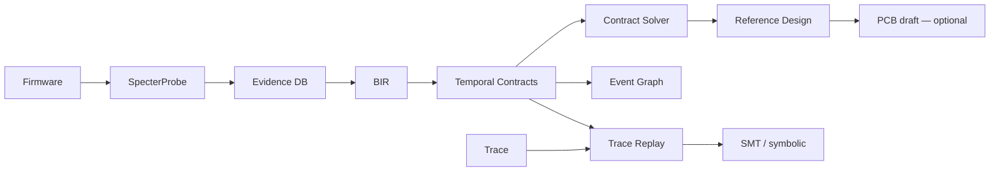

# B.A.S.E. — Behavioral ASIC Synthesis Engine

[](https://github.com/bmcc-DEV/B.A.S.E./actions/workflows/ci.yml)
[](https://github.com/bmcc-DEV/B.A.S.E./actions/workflows/formal.yml)
[](LICENSE.md)

> *"O que este hardware faz?" em vez de "Como este hardware foi implementado?"*

**Motor de engenharia reversa comportamental assistida** — evidência → contratos → Reference Design.

> **Tag [`v0.3.0-rc`](https://github.com/bmcc-DEV/B.A.S.E./releases/tag/v0.3.0-rc)** · plano seguinte [Path to v0.4](base-vault/14%20-%20Path%20to%20v0.4/14.00%20-%20Index.md) · baseline [Path to v0.3](base-vault/13%20-%20Path%20to%20v0.3/13.00%20-%20Index.md) / [Case Study](base-vault/12%20-%20Path%20to%20Real/12.20%20-%20Pilot%20Case%20Study.md):
> Capstone UART + Z3 formal opcional + pins RP2040 + HIL EXPERIMENTAL. Demo: [Playbook](base-vault/13%20-%20Path%20to%20v0.3/13.20%20-%20Forensic%20Playbook.md) / `./examples/pilot/run_v03.sh`.
> **Não** é gerador de PCB fabricável nem substituto drop-in de ASIC.

---

## O que funciona hoje

Fonte da verdade: vault Obsidian → [**Maturity Matrix**](base-vault/12%20-%20Path%20to%20Real/12.02%20-%20Maturity%20Matrix.md)

| Área | Estado |
|------|--------|
| `analyze` + Evidence DB + `--disasm` / `--mmio-traces` | Útil no wedge ARM |
| `design` / `synth` + component DB + contratos | Funcional; depende da qualidade do spec |
| `replay` / `prove` (simbólico; Z3 opcional) / `event-graph` / `bir` | Auditável com fixtures |
| `fw` | Skeleton **host-testable** (`make host`) — não firmware de produção |
| `pcb` | **Engineering draft** KiCad — *not fabricable* |
| `pipeline` | Orquestra estágios verdes; `--pcb` / `--evolve` opt-in |
| `evolve` | Scaffold — off por default |
| `base-hil` | **EXPERIMENTAL** — host template; sem flash automático sem probe |

Planos: [v0.2 Master](base-vault/12%20-%20Path%20to%20Real/12.01%20-%20Master%20Plan.md) · [v0.3 Master](base-vault/13%20-%20Path%20to%20v0.3/13.01%20-%20Master%20Plan.md) · [Sprint Board v0.3](base-vault/13%20-%20Path%20to%20v0.3/13.04%20-%20Sprint%20Board.md)

---

## Pipeline (alvo)

```text
Firmware → analyze → Evidence DB → BIR → Contracts → Solver → Reference Design
                                                              ↓
                                                    [PCB/FW draft — opcional]
```

---

## Quick Start

```bash
git clone https://github.com/bmcc-DEV/B.A.S.E..git
cd B.A.S.E.
cargo build -p base-cli
```

### Piloto (fixtures — start here)

```bash
# Case study: base-vault/12 - Path to Real/12.20 - Pilot Case Study.md
cargo build -p base-cli
./examples/pilot/run.sh
# → examples/pilot/out/CASE_SUMMARY.md
```

### Análise

```bash
base analyze firmware.bin --disasm --dot -o output/
# → hardware_spec.yaml + evidence_db.yaml (+ DOT se --dot)
```

### Reference Design (saída principal)

```bash
base design output/hardware_spec.yaml -o output/design/
# → reference_design.yaml (engineering draft de arquitetura)
```

### Replay / prova

```bash
base replay trace.csv --contracts contracts.yaml -o violations.json
base prove contracts.yaml -o proof/   # simbólico por default; proof_report.json inclui backend
```

### Prova formal Z3 (opcional)

Default `cargo test` / CI principal **não** exige Z3. Com libz3 no sistema:

```bash
# Debian/Ubuntu: sudo apt-get install -y libz3-dev
cargo test -p base-core --features solver_z3 --lib smt
# CLI usa simbólico por default; Z3 entra ao linkar base-core com solver_z3
```

Job isolado: [`.github/workflows/formal.yml`](.github/workflows/formal.yml) (`workflow_dispatch` + nightly semanal). Detalhes: [SMT Real](base-vault/11%20-%20B.A.S.E.%20v3.2%20Scientific/11.04%20-%20SMT%20Real.md).

---

## Arquitetura



### Tensão Ψ

```text
Ψ(B, H) = ∫ δ(ω_obs, ω_H) dμ
confidence = max(0, 1 - Ψ/(1+Ψ))
```

---

## CLI

| Comando | Notas |
|---------|-------|
| `analyze` | HardwareSpec + Evidence DB |
| `synth` / `design` | Mapping + Reference Design |
| `replay` / `prove` / `event-graph` | Contratos temporais |
| `bir` | Validate / compile BSL / export |
| `fw` | Draft C + `make host` |
| `pcb` | Draft KiCad (experimental) |
| `check` / `evolve` / `pipeline` / `reconstruct` | Ver Maturity Matrix |

---

## Mercados (realista)

| Mercado | Papel v0.2 |
|---------|------------|
| Forense / segurança | **Wedge principal** — Evidence + contratos + design |
| Educação / pesquisa | Pipeline visual + Ψ |
| Preservação industrial | Consultoria humana + tool assist — não turnkey |
| SaaS PME | Depois de adoção do case study v0.2 |

Detalhes: [`COMMERCIAL.md`](COMMERCIAL.md).

---

## Licença

AGPLv3 — [LICENSE.md](LICENSE.md)

Uso proprietário sem compartilhar modificações: licença comercial disponível.
