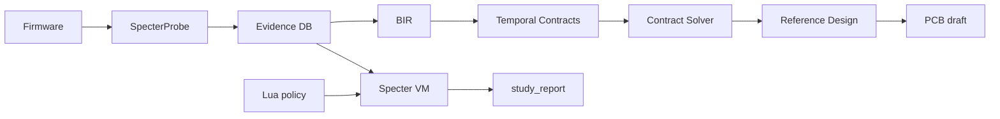

# B.A.S.E. — Behavioral ASIC Synthesis Engine

[](https://github.com/bmcc-DEV/B.A.S.E./actions/workflows/ci.yml)
[](https://github.com/bmcc-DEV/B.A.S.E./actions/workflows/formal.yml)
[](LICENSE.md)
[](https://github.com/bmcc-DEV/B.A.S.E./releases/tag/v1.1.0-rc)

> *"O que este hardware faz?" em vez de "Como este hardware foi implementado?"*

**Motor de engenharia reversa comportamental assistida** — evidência → contratos → Reference Design.

> **Tag [`v1.6.0-rc`](https://github.com/bmcc-DEV/B.A.S.E./releases/tag/v1.6.0-rc)** · Specter Live [`v1.5.0-rc`](https://github.com/bmcc-DEV/B.A.S.E./releases/tag/v1.5.0-rc) · OS-port [`v1.4.0-rc`](https://github.com/bmcc-DEV/B.A.S.E./releases/tag/v1.4.0-rc) · [CHANGELOG](CHANGELOG.md)
>
> Twin↔guest + Specter Live + OS Port Validation Assist.
>
> Demo: `./examples/pilot_moto_g35/run_virt_live.sh` · `base virt twin|bir-twin|watch`.
>
> **Não** é port ReactOS/TaurOS turnkey, PCB fabricável nem HIL production.

---

## O que funciona hoje

Fonte da verdade: [**Maturity Matrix**](base-vault/12%20-%20Path%20to%20Real/12.02%20-%20Maturity%20Matrix.md)

### CLI / pipeline

| Área | Estado |
|------|--------|
| `analyze` / `design` / `synth` / `replay` / `prove` / `bir` / `check` / `pipeline` | **REAL\*** no wedge |
| `study` (Specter VM Forth + Lua) | **REAL\*** — loop autónomo; `auto_fix_complete=false` |
| `reconstruct` | **REAL\*** — `stop_reason`; ≠ auto-fix |
| `evolve` | **REAL\*** — métricas do HardwareSpec; opt-in no pipeline |
| `fw` | **REAL\*** host (`make host`); ≠ silício |
| `pcb` | **REAL\*** draft KiCad (`NOT FABRICABLE`) |
| `hil` | **REAL\*** host + **Gate A** `lab-status`; production gated |
| `port package` | **EXPERIMENTAL** — mapa/fósseis/atlas; ≠ OS rewrite |

### Wedges / smokes

| Wedge | Smoke |
|-------|-------|
| RP UART / SPI | `run.sh` / `run_t1_b2.sh` |
| STM32 USART/SPI/I2C/TIM/triple | `pilot_stm32/run*.sh` |
| Specter study | `examples/pilot_study/run_study.sh` |
| Moto G35 OS-port A | `examples/pilot_moto_g35/run.sh` |
| iMac G3 OS-port A | `examples/pilot_imac_g3/run.sh` |

Docs: [Path to v1.4](base-vault/24%20-%20Path%20to%20v1.4/24.00%20-%20Index.md) · [Path to v1.1](base-vault/21%20-%20Path%20to%20v1.1/21.00%20-%20Index.md)

---

## Pipeline

```text
Firmware → analyze → Evidence DB → BIR → Contracts → Solver → Reference Design
                         ↓
              study (Forth+Lua) / reconstruct
                         ↓
              [PCB/FW draft — opcional]
```

---

## Quick Start

```bash
git clone https://github.com/bmcc-DEV/B.A.S.E..git
cd B.A.S.E.
cargo build -p base-cli

./examples/pilot/run.sh
./examples/pilot/run_t1_b2.sh
./examples/pilot_study/run_study.sh
```

### Specter study

```bash
base study path/to/hardware_spec.yaml \
  --policy examples/pilot_study/policy.lua \
  --program examples/pilot_study/study.base \
  -o out/study/
# → study_report.json (stop_reason, auto_fix_complete=false)
```

### Análise / design / HIL

```bash
base analyze firmware.bin --mmio-traces mmio.json --classify uart -o output/
base design output/hardware_spec.yaml --pcb -o output/design/
base hil enumerate -o /tmp/hil/
base hil flash /tmp/x.bin --mock-flash -o /tmp/hil/
```

### Z3 (opcional)

```bash
cargo test -p base-core --features solver_z3 --lib smt
```

---

## Arquitetura



### Tensão Ψ

```text
Ψ(B, H) = ∫ δ(ω_obs, ω_H) dμ
confidence = max(0, 1 - Ψ/(1+Ψ))
```

---

## CLI

| Comando | Notas |
|---------|-------|
| `analyze` / `synth` / `design` | Evidence → Reference Design |
| `study` | Specter Forth + Lua |
| `reconstruct` | Refine estrutural |
| `replay` / `prove` / `event-graph` / `bir` | Contratos |
| `evolve` / `fw` / `pcb` / `check` / `pipeline` | Outputs + validação |
| `hil` | Host REAL\*; production gated |

---

## Mercados

| Mercado | Papel |
|---------|-------|
| Forense / segurança | Wedge principal |
| Educação / pesquisa | Pipeline + Ψ + Specter |
| Preservação industrial | Consultoria + [SOW v1.1](base-vault/21%20-%20Path%20to%20v1.1/21.21%20-%20SOW%20Industrial%20Checklist.md) |
| SaaS | Adiado |

[`COMMERCIAL.md`](COMMERCIAL.md)

### Claims proibidos

PCB fabricável · ASIC drop-in · HIL production · SaaS turnkey · auto-fix completa · “produto industrial completo”

---

## Documentação

| Doc | Papel |
|-----|-------|
| [HIL Lab Gate A](base-vault/23%20-%20Path%20to%20v1.3/23.30%20-%20HIL%20Lab%20Gate.md) | `base hil lab-status` |
| [SOW Industrial Gate](base-vault/22%20-%20Path%20to%20v1.2/22.30%20-%20SOW%20Industrial%20Gate.md) | Quando promover PCB/HIL/fix |
| [Maturity Matrix](base-vault/12%20-%20Path%20to%20Real/12.02%20-%20Maturity%20Matrix.md) | Fonte da verdade |
| [Playbook v1.2](base-vault/22%20-%20Path%20to%20v1.2/22.20%20-%20Forensic%20Playbook.md) | Demo + gate |
| [Specter VM Spec](base-vault/21%20-%20Path%20to%20v1.1/21.30%20-%20Specter%20VM%20Spec.md) | Palavras + Lua |
| [CHANGELOG](CHANGELOG.md) | Tags |

---

## Licença

AGPLv3 — [LICENSE.md](LICENSE.md)
