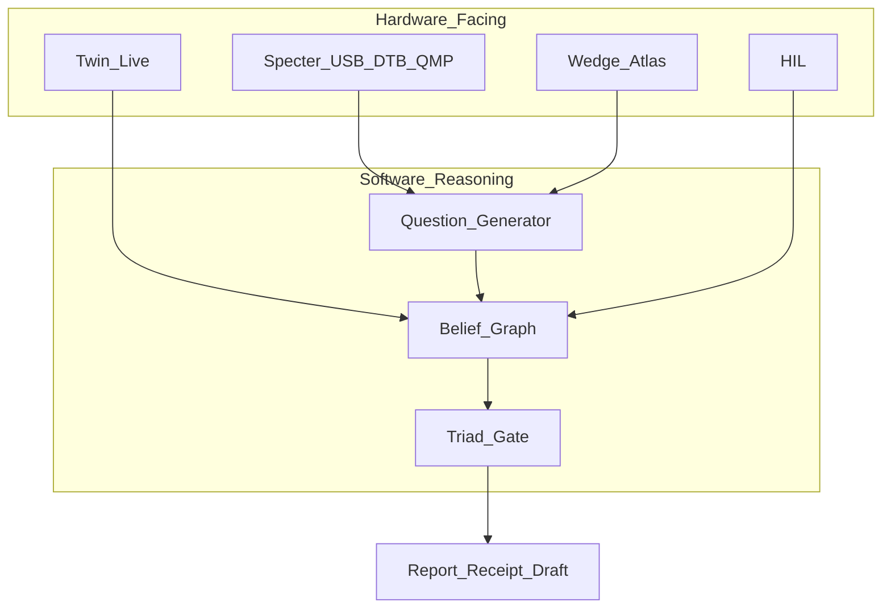

# B.A.S.E. — Behavioral ASIC Synthesis Engine

[](https://github.com/bmcc-DEV/B.A.S.E./actions/workflows/ci.yml)
[](https://github.com/bmcc-DEV/B.A.S.E./actions/workflows/formal.yml)
[](LICENSE.md)
[](https://github.com/bmcc-DEV/B.A.S.E./releases/tag/v1.1.0-rc)

> *"O que este hardware faz?" em vez de "Como este hardware foi implementado?"*

**Plataforma de engenharia reversa automatizada assistida por evidência** — percepção HW + raciocínio SW (QRM / belief / triad).

> **Honesty:** `generates_os: false` · `auto_fix_complete: false` · `static_recomp_complete: false` · flash = lab assist / manual  
> **Tags:** [`v1.8.0-rc`](https://github.com/bmcc-DEV/B.A.S.E./releases/tag/v1.8.0-rc) · [`v1.7.0-rc`](https://github.com/bmcc-DEV/B.A.S.E./releases/tag/v1.7.0-rc) · [`v1.6.3-rc`](https://github.com/bmcc-DEV/B.A.S.E./releases/tag/v1.6.3-rc) · [CHANGELOG](CHANGELOG.md) · [Platform RE](docs/PLATFORM_RE.md) · [Static Recomp](docs/STATIC_RECOMP.md)
>
> ≠ OS turnkey · ≠ PCB fabricável · ≠ HIL production · ≠ Transformer / “RE mágica” · ≠ Wine / Win32 completo

---

## Divisão HW / SW

| Lado | Papel | Crates |
|------|--------|--------|
| **Hardware-facing** | Aquisição de evidência imutável | `specterprobe`, `base-virt` (QMP/Live), `base-port` (USB×DT/wedge), `base-hil`, `base-core` evidence |
| **Software reasoning** | Perguntas → crenças → hipóteses → triad | **`base-reason`** |
| **Static recomp** | x86 → SIR → multi-ISA + **preservação semântica** (Path v1.7 → v1.9) | **`base-recomp`** |

Loop: **observar → perguntar → hipotetizar → lab/receipt → strengthen/forget**.

---

## O que funciona hoje

Fonte da verdade: [**Maturity Matrix**](base-vault/12%20-%20Path%20to%20Real/12.02%20-%20Maturity%20Matrix.md)

### CLI / pipeline

| Área | Estado |
|------|--------|
| `analyze` / `design` / `synth` / `replay` / `prove` / `bir` / `check` / `pipeline` | **REAL\*** no wedge |
| `study` (Specter VM Forth + Lua) | **REAL\*** — loop autónomo; `auto_fix_complete=false` |
| `reconstruct` | **REAL\*** — `stop_reason`; ≠ auto-fix |
| `reason` | **REAL\*** — QRM/belief/triad sobre atlas/sinais; ≠ Transformer |
| `recomp` | **EXPERIMENTAL** — lift x86 → SIR → encode/decode **11 ISAs** + verifier round-trip (literal/semantic/differential) + catálogo semântico + **preservation reports** (níveis P0–P5); ≠ Wine / ≠ PE |
| `recomp verify` / `semantics` | Round-trip por dimensão (`enc`/`dec`/`literal`/`semantic`/`exec`/`differential`) + sweep gerado |
| `recomp report` | **Preservation Layer** — matriz + relatório por ISA (nível P0–P5, evidência medida, gaps) → snapshot em [`base-vault/isa/`](base-vault/isa/README.md) |
| `port` (package / usb-probe / wedge / clocks-pinctrl) | **EXPERIMENTAL** — mapa/fósseis/atlas; ≠ OS rewrite |
| `virt` (Specter Live / QMP / twin) | **EXPERIMENTAL** — ≠ OS turnkey |
| `evolve` / `fw` / `pcb` | **REAL\*** drafts; PCB `NOT FABRICABLE` → pacote [hardware/](hardware/README.md) (Claim B) |
| `hil` | **REAL\*** host + Gate A; production gated |

### Wedges / smokes

| Wedge | Smoke |
|-------|-------|
| RP UART / SPI | `run.sh` / `run_t1_b2.sh` |
| STM32 USART/SPI/I2C/TIM/triple | `pilot_stm32/run*.sh` |
| Specter study | `examples/pilot_study/run_study.sh` |
| Moto G35 Path A + reason | `run_path_a.sh` · `base reason g35` · [REASONING](examples/pilot_moto_g35/REASONING.md) |
| Moto G35 wedge P0 | `run_wedge_pipeline.sh` · [WEDGE_HANDOFF](examples/pilot_moto_g35/WEDGE_HANDOFF.md) |
| iMac G3 OS-port A | `examples/pilot_imac_g3/run.sh` |

---

## Preservação semântica (Path v1.9)

> *"O que este hardware faz?" ≠ "como foi implementado"* — B.A.S.E. preserva a **semântica**
> das 11 arquiteturas (PowerPC · MIPS · DEC Alpha · PA-RISC · ARM · M88k · IA-64 · SPARC ·
> i860 · ColdFire · SuperH), não apenas executa binários.

| ISA | Encode | Decode | Differential |
|-----|--------|--------|--------------|
| MIPS · PPC · SuperH · **Alpha** · **PA-RISC** · **ColdFire** · **AArch64** · **ARM** · **SPARC** · **x86_64** | ✅ subset | ✅ | ✅ verificado |
| **ColdFire** | ✅ **load/store + push/pop** (12/14 kinds, 86%) | ✅ | ✅ **memória real** (BE, sweep 268/268) |
| M88k · IA-64 · i860 | emit texto | — pendente | — |

```bash
base recomp semantics                        # catálogo semântico (regs, endianness, flags, quirks, ABI) + JSON
base recomp verify --hex 90C3 --target mips  # SIR → encode → bytes → decode → SIR′ (literal + semântico)
base recomp verify --all                     # cobertura por dimensão por ISA
base recomp verify --sweep --target coldfire # matriz gerada imms × estados × kinds (comportamento)
base recomp report --isa mips                # preservation report (nível P0–P5, evidência medida, gaps)
base recomp report --matrix                  # matriz de preservação por ISA
```

Três níveis de confiança:

```text
literal      "os mesmos bytes recuperam a mesma forma?"
semantic     "a forma recuperada tem o mesmo significado?"     (domínio 32-bit do SIR)
differential "ela produz o mesmo estado arquitetural?"         (largura real do ISA)
```

O verifier **já pegou bugs reais** que o round-trip representacional não via: PPC `r0`
(lê como 0 no RA de `addi`) e ColdFire `Dn` (bits 5-3 sem shift). Ao adicionar
`load/store` ao SIR, o **encoder ColdFire push/pop foi validado contra capstone m68k** e
revelou bug duplo: `0x29C0` era `move.l d0,(a4)+` (não push) e `Dn` estava em bits
errados — o sweep só usava VReg 0 (D0), então o roundtrip antigo era
consistente-mas-errado. Fix: `0x2F00|dn` (push, Dn em bits 2-0) e `0x201F|dn<<9` (pop).
E o diferencial **revelou e corrigiu** uma inconsistência de modelo: o executor de
referência tratava immediates SIR como `u32` quando o domínio é `i32` — o "gap de
sign-extension" do Alpha era isso (encoder LDA já sign-extendia); fix no `semexec`
alinhou referência e ISA (Alpha differential 50% → 57% com 14 kinds, P4). Eixos
`abi`/`privileged`/`mmu`/`system` = **0%
(não modelados)** — explícito, nunca um score único que pareça "80% do MIPS".
Fonte: [docs/STATIC_RECOMP.md](docs/STATIC_RECOMP.md) ·
vault [`29 - Path to v1.9`](base-vault/29%20-%20Path%20to%20v1.9/29.00%20-%20Index.md)

---

## Pipeline

```text
Firmware / USB / DTB / QMP
        ↓
   Hardware-facing (Specter · wedge · twin)
        ↓
   Evidence DB → BIR → Contracts → Solver → Reference Design
        ↓
   base-reason (QRM · belief · triad) → report / receipt draft
        ↓
   study / reconstruct / [PCB·FW draft opcional]
```

---

## Quick Start

```bash
git clone https://github.com/bmcc-DEV/B.A.S.E..git
cd B.A.S.E.
cargo build -p base-cli

./examples/pilot/run.sh
./examples/pilot_study/run_study.sh
./examples/pilot_moto_g35/run_wedge_pipeline.sh
```

### Recomp / preservação semântica

```bash
cargo build -p base-cli
./target/debug/base recomp semantics
./target/debug/base recomp verify --hex B80100000083C002C3 --target mips -o output/verify
./target/debug/base recomp verify --all
./target/debug/base recomp verify --sweep --target coldfire
```

### Reason (G35)

```bash
cargo build -p base-cli
./target/debug/base reason g35 -o output/reason_g35
# → reason_report.md · reason_receipt_draft.json (flashed: false)
```

### Specter study

```bash
base study path/to/hardware_spec.yaml \
  --policy examples/pilot_study/policy.lua \
  --program examples/pilot_study/study.base \
  -o out/study/
```

### Análise / HIL

```bash
base analyze firmware.bin --mmio-traces mmio.json --classify uart -o output/
base hil enumerate -o /tmp/hil/
base hil flash /tmp/x.bin --mock-flash -o /tmp/hil/
```

---

## Arquitectura


```mermaid
flowchart TB
  subgraph hw [Hardware_Facing]
    Acq[Specter_USB_DTB_QMP]
    Twin[Twin_Live]
    Atlas[Wedge_Atlas]
    Hil[HIL]
  end
  subgraph sw [Software_Reasoning]
    QRM[Question_Generator]
    Bel[Belief_Graph]
    Tri[Triad_Gate]
  end
  Acq --> QRM
  Twin --> Bel
  Atlas --> QRM
  QRM --> Bel
  Bel --> Tri
  Tri --> Out[Report_Receipt_Draft]
  Hil --> Bel
```

### Tensão Ψ

```text
Ψ(B, H) = ∫ δ(ω_obs, ω_H) dμ
confidence = max(0, 1 - Ψ/(1+Ψ))
```

---

## CLI

| Comando | Notas |
|---------|-------|
| `analyze` / `synth` / `design` | Evidence → Reference Design |
| `reason` | QRM + belief + triad (HW signals → report) |
| `port` / `virt` | Wedge atlas · Specter Live / QMP |
| **Identify API** (`base-api`) | Canonical v1: `/v1/identify` · `/v1/prove` · `/v1/usage` · OpenAPI · `saas_production=false` |
| `study` / `reconstruct` | Specter Forth+Lua · refine |
| `replay` / `prove` / `event-graph` / `bir` | Contratos |
| `recomp` | lift x86 → SIR → encode/decode/emit 14 alvos · `semantics` (catálogo 11 ISAs) · `verify` (round-trip + cobertura por dimensão + sweep) |
| `evolve` / `fw` / `pcb` / `check` / `pipeline` | Outputs + validação |
| `hil` | Host REAL\*; production gated |

---

## Mercados

| Mercado | Papel |
|---------|-------|
| Forense / segurança | Wedge principal + reason loop |
| Educação / pesquisa | Pipeline + Ψ + Specter |
| Preservação industrial | Consultoria + [SOW v1.1](base-vault/21%20-%20Path%20to%20v1.1/21.21%20-%20SOW%20Industrial%20Checklist.md) |
| SaaS | Adiado |

[`COMMERCIAL.md`](COMMERCIAL.md)

### Claims proibidos

PCB fabricável · ASIC drop-in · HIL production · SaaS turnkey · auto-fix completa · OS turnkey · “produto industrial completo”

---

## Documentação

| Doc | Papel |
|-----|-------|
| [Platform RE HW/SW](docs/PLATFORM_RE.md) | Divisão percepção / raciocínio |
| [G35 Reasoning](examples/pilot_moto_g35/REASONING.md) | Slice vertical reason |
| [G35 postmarketOS](examples/pilot_moto_g35/POSTMARKETOS.md) | Port externo (≠ B.A.S.E. gera OS) |
| [WEDGE_HANDOFF](examples/pilot_moto_g35/WEDGE_HANDOFF.md) | Handoff tree externo |
| [Maturity Matrix](base-vault/12%20-%20Path%20to%20Real/12.02%20-%20Maturity%20Matrix.md) | Fonte da verdade |
| [CHANGELOG](CHANGELOG.md) | Tags |

---

## Licença

AGPLv3 — [LICENSE.md](LICENSE.md)
