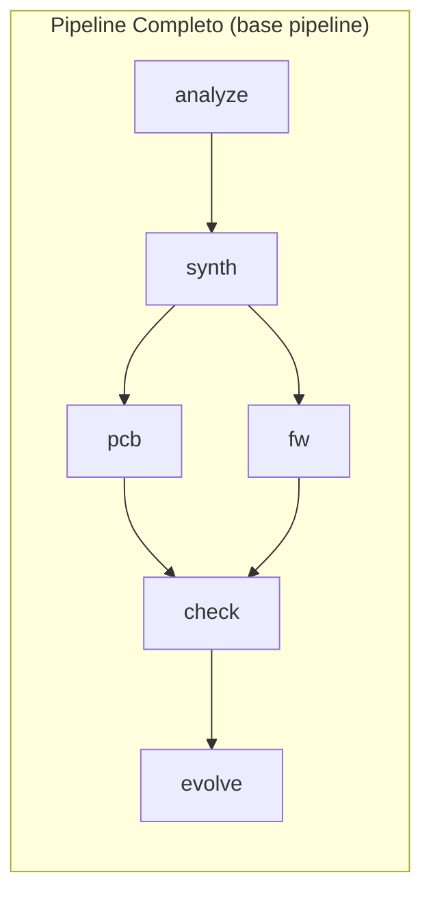

# 🏗️ B.A.S.E. — Behavioral ASIC Synthesis Engine

> *"O que este hardware faz?" em vez de "Como este hardware foi implementado?"*

**Status:** ✅ 7 crates, 75 testes, 0 erros — pipeline end-to-end funcional



## Mapa da Vault

```mermaid
mindmap
  root((B.A.S.E. 🧬))
    Architecture
      Overview
      Pipeline Flow
      Data Model
      Component Diagram
    Layers
      Foundation (SpecterProbe) ✅
      Inference Engine ✅
      HAL Translation ✅
      PCB Generator ✅
      Validation ⚠️
      Evolution Engine ✅
    Technical Specs
      HardwareSpec Schema
      Behavioral Graph
      KiCad S-Expression
      MMU Translation
      Timing Model
      Validation Metrics
    Component DB
      Schema
      RP2350, Cortex-A55
      Catalog Index (51 entries)
    Implementation
      Roadmap (status atual)
      Sprints 0-7
    Use Cases
      Power Mac G5
      Amiga CD32
      Xbox 360
      DEC Alpha
    References
      Tools
      Dependencies
      Glossary
```

## O Problema

Hardware proprietário morre quando:

- O ASIC queima e não há reposição
- O fabricante para de produzir
- O suporte termina
- O RTL / GDSII / máscaras se perdem

## A Solução

**B.A.S.E.** pega o que **existe** (firmware, drivers, traces, logs) e reconstrói o **comportamento** do hardware — não a implementação — permitindo sintetizar uma nova PCB compatível usando componentes modernos e disponíveis.

```
Hardware Original (ASICs)
      ↓ Firmware
      ↓ Drivers
      ↓ Comportamento
      ↓ Modelo Funcional
      ↓ Nova PCB + Firmware Sintético
```

## Projetos Relacionados

- [[02 - Layers/02.01 Foundation (SpecterProbe)|SpecterProbe]] — Análise de firmware (9 camadas, Rust)
- [[01 - Architecture/01.01 Overview|Visão Geral Arquitetural]]

## Quick Start

```bash
# Pipeline completo
base pipeline firmware.bin --trace original.csv --target rp2350

# Apenas análise
base analyze firmware.bin -o output/

# Apenas PCB a partir de spec existente
base synth output/hardware_spec.yaml -o synth/
base pcb synth/synthesized_spec.yaml --drc -o pcb/

# Apenas firmware
base fw synth/synthesized_spec.yaml --zephyr -o fw/

# Validação
base check synth/synthesized_spec.yaml original.csv -o check/

# Sugestões de upgrade
base evolve synth/synthesized_spec.yaml -o evolve/
```

## Estrutura do Projeto

```
📁 base-vault/        ← Obsidian vault (documentação)
📁 specterprobe/      ← Análise de firmware (Rust)
📁 base-core/          ← Inferência + mapeamento (Rust)
📁 base-pcb/           ← Gerador KiCad (Rust)
📁 base-fw/            ← Firmware sintético (Rust)
📁 base-check/         ← Validação (Rust)
📁 base-evolve/        ← Motor de evolução (Rust)
📁 base-cli/           ← CLI unificada (Rust)
📁 .github/workflows/  ← CI/CD
```

## Princípios Arquiteturais

1. **Separação comportamento × implementação** — O modelo comportamental é independente do hardware alvo
2. **Pipeline progressivo** — Cada etapa refina o modelo, aumentando a confiança
3. **Múltiplas fontes de verdade** — Firmware + traces + drivers + DTB = modelo mais robusto
4. **Saída sempre verificável** — Toda geração produz relatório de validação
5. **Design modular** — Cada crate é independente, testável e substituível

## Navegação Rápida

| Área | Nota |
|------|------|
| 🏛️ Arquitetura | [[01 - Architecture/01.01 Overview]] |
| 📦 Foundation | [[02 - Layers/02.01 Foundation (SpecterProbe)]] |
| 🧠 Inference | [[02 - Layers/02.02 Inference Engine]] |
| 🔄 HAL | [[02 - Layers/02.03 HAL Translation]] |
| 📐 PCB | [[02 - Layers/02.04 PCB Generator]] |
| ✅ Validação | [[02 - Layers/02.05 Validation]] |
| 🚀 Evolução | [[02 - Layers/02.06 Evolution Engine]] |
| 📋 Roadmap | [[05 - Implementation/05.01 Roadmap]] |
| 📊 Sprints | [[05 - Implementation/05.02 Sprint 0]] → [[05 - Implementation/05.09 Sprint 7]] |
