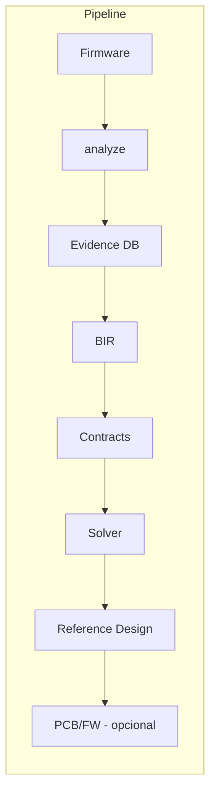

# 🏗️ B.A.S.E. — Behavioral ASIC Synthesis Engine

> *"O que este hardware faz?" em vez de "Como este hardware foi implementado?"*

**Path to Real ativo · [[12 - Path to Real/12.00 - Index|Seção 12]] · Maturity Matrix em [[12 - Path to Real/12.02 - Maturity Matrix|12.02]]**



## Mapa da Vault

| Seção | Conteúdo |
|-------|----------|
| [[01 - Architecture/01.01 Overview\|🏛️ Arquitetura]] | Stack de camadas, fluxo de dados, decisões |
| [[02 - Layers/02.01 Foundation (SpecterProbe)\|📦 Foundation]] | SpecterProbe (disassembly, MMIO, behavioral) |
| [[02 - Layers/02.02 Inference Engine\|🧠 Inference]] | Motor de inferência |
| [[02 - Layers/02.03 HAL Translation\|🔄 HAL]] | Tradução MMIO |
| [[02 - Layers/02.04 PCB Generator\|📐 PCB]] | Gerador KiCad |
| [[02 - Layers/02.05 Validation\|✅ Validação]] | Comparador de traces |
| [[02 - Layers/02.06 Evolution Engine\|🚀 Evolução]] | Sugestões de upgrade |
| [[03 - Technical Specs\|📋 Specs]] | HardwareSpec, BIR, KiCad, MMU, Timing |
| [[05 - Implementation/05.01 Roadmap\|📊 Roadmap]] | Status dos sprints |
| [[08 - Glossary\|📖 Glossário]] | Termos do projeto |
| [[09 - B.A.S.E. v2 Expansion/09.00 - Index\|🧬 v2]] | Universal HW Reconstruction (12 fases) |
| [[10 - B.A.S.E. v3.1 Evidence-Driven/10.00 - Index\|🔬 v3.1]] | Evidence-Driven Architecture |
| [[11 - B.A.S.E. v3.2 Scientific/11.00 - Index\|⚛ v3.2]] | Scientific Evolution |
| [[12 - Path to Real/12.00 - Index\|🛤️ Path to Real]] | Plano para tornar o produto auditável (R0–R6) |
| [[12 - Path to Real/12.01 - Master Plan\|📌 Master Plan]] | Norte v0.2 + métricas + anti-overclaim |

## Crates

| Crate | Tests | Descrição |
|-------|-------|-----------|
| `base-core` | 77 | Core: Evidence DB, BIR, Contracts, Solver, Digital Twin, Knowledge Graph, SMT |
| `base-bir` | 13 | Behavioral IR: tipos, validador, contratos temporais |
| `base-pcb` | 15 | Gerador KiCad: S-expression, schematic, BOM, PCB, DRC |
| `base-fw` | 13 | Firmware sintético: bootloader, HAL MMU, drivers, devicetree, Zephyr |
| `base-check` | 20 | Validação: trace Saleae/PCAP/JSON, comparator, HTML report |
| `base-evolve` | 7 | Evolução: bottleneck analysis, trade-offs, migration plans |
| `base-cli` | 3 | CLI unificada |
| `base-hil` | 6 | HIL Cluster: RP2350 probe firmware, host agent |
| `base-bsl` | 0* | BSL Language (parser pest — gramática pendente) |
| `specterprobe` | — | Análise ARM64: disassembly Capstone, CFG, MMIO scan |

> *base-bsl com erro no pest grammar — aguardando correção*

## GitHub

```
commit 0e3961f — main → origin/main
154 testes · 13 crates · 3 gerações · Push feito ✅
```
