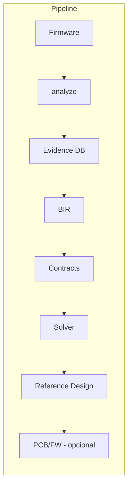

# 🏗️ B.A.S.E. — Behavioral ASIC Synthesis Engine

> *"O que este hardware faz?" em vez de "Como este hardware foi implementado?"*

**v0.9.0 ✅ · tag [`v1.0.0-rc`](https://github.com/bmcc-DEV/B.A.S.E./releases/tag/v1.0.0-rc) · [[20 - Path to v1.0/20.00 - Index|Path to v1.0]] · [[19 - Path to v0.9/19.00 - Index|Path to v0.9]] · [[18 - Path to v0.8/18.00 - Index|Path to v0.8]] · [[17 - Path to v0.7/17.00 - Index|Path to v0.7]] · [[16 - Path to v0.6/16.00 - Index|Path to v0.6]] · [[15 - Path to v0.5/15.00 - Index|Path to v0.5]] · [[14 - Path to v0.4/14.00 - Index|Path to v0.4]] · [[12 - Path to Real/12.20 - Pilot Case Study|Pilot Case Study]] · [[12 - Path to Real/12.02 - Maturity Matrix|Maturity Matrix]]**



## Mapa da Vault

| Seção | Conteúdo |
|-------|----------|
| [[01 - Architecture/01.01 Overview\|🏛️ Arquitetura]] | Stack de camadas, fluxo de dados, decisões |
| [[02 - Layers/02.01 Foundation (SpecterProbe)\|📦 Foundation]] | SpecterProbe (disassembly, MMIO, behavioral) |
| [[02 - Layers/02.02 Inference Engine\|🧠 Inference]] | Motor de inferência |
| [[02 - Layers/02.03 HAL Translation\|🔄 HAL]] | Tradução MMIO |
| [[02 - Layers/02.04 PCB Generator\|📐 PCB]] | Gerador KiCad |
| [[02 - Layers/02.05 Validation\|✅ Validação]] | Comparador de traces |
| [[02 - Layers/02.06 Evolution Engine\|🚀 Evolução]] | Sugestões de upgrade |
| [[03 - Technical Specs\|📋 Specs]] | HardwareSpec, BIR, KiCad, MMU, Timing |
| [[05 - Implementation/05.01 Roadmap\|📊 Roadmap]] | Status dos sprints |
| [[08 - Glossary\|📖 Glossário]] | Termos do projeto |
| [[09 - B.A.S.E. v2 Expansion/09.00 - Index\|🧬 v2]] | Universal HW Reconstruction (12 fases) |
| [[10 - B.A.S.E. v3.1 Evidence-Driven/10.00 - Index\|🔬 v3.1]] | Evidence-Driven Architecture |
| [[11 - B.A.S.E. v3.2 Scientific/11.00 - Index\|⚛ v3.2]] | Scientific Evolution |
| [[12 - Path to Real/12.00 - Index\|🛤️ Path to Real]] | v0.2 ✅ — produto auditável no wedge (R0–R6) |
| [[12 - Path to Real/12.20 - Pilot Case Study\|🧪 Pilot Case Study]] | Case study UART v0.2 |
| [[13 - Path to v0.3/13.00 - Index\|🚀 Path to v0.3]] | v0.3.0-rc ✅ (S0–S5) |
| [[13 - Path to v0.3/13.20 - Forensic Playbook\|🧭 Playbook]] | Demo forense 1 página |
| [[14 - Path to v0.4/14.00 - Index\|🛤️ Path to v0.4]] | v0.4.0 ✅ (T0–T5) |
| [[15 - Path to v0.5/15.00 - Index\|🚀 Path to v0.5]] | v0.5.0 ✅ (U0–U5) |
| [[15 - Path to v0.5/15.20 - Forensic Playbook\|🧭 Playbook v0.5]] | Demo forense RP + STM32 |
| [[20 - Path to v1.0/20.00 - Index\|🚀 Path to v1.0]] | Z0–Z5 ✅ · tag `v1.0.0-rc` |
| [[20 - Path to v1.0/20.01 - Master Plan\|📌 Master Plan v1.0]] | L25–L27 |
| [[20 - Path to v1.0/20.04 - Sprint Board\|📋 Sprint Board v1.0]] | Kanban Z0–Z5 |
| [[20 - Path to v1.0/20.20 - Forensic Playbook\|🧭 Playbook v1.0]] | Demo forense RP + STM32 SPI/I2C/TIM |
| [[19 - Path to v0.9/19.00 - Index\|🚀 Path to v0.9]] | v0.9.0 ✅ (Y0–Y5) |
| [[19 - Path to v0.9/19.20 - Forensic Playbook\|🧭 Playbook v0.9]] | Demo forense RP + STM32 SPI/I2C/triple |
| [[19 - Path to v0.9/19.01 - Master Plan\|📌 Master Plan v0.9]] | L22–L24 |
| [[19 - Path to v0.9/19.04 - Sprint Board\|📋 Sprint Board v0.9]] | Kanban Y0–Y5 |
| [[18 - Path to v0.8/18.00 - Index\|🚀 Path to v0.8]] | v0.8.0 ✅ (X0–X5) |
| [[18 - Path to v0.8/18.20 - Forensic Playbook\|🧭 Playbook v0.8]] | Demo forense RP + STM32 SPI/I2C |
| [[18 - Path to v0.8/18.01 - Master Plan\|📌 Master Plan v0.8]] | L19–L21 |
| [[18 - Path to v0.8/18.04 - Sprint Board\|📋 Sprint Board v0.8]] | Kanban X0–X5 |
| [[17 - Path to v0.7/17.00 - Index\|🚀 Path to v0.7]] | v0.7.0 ✅ (W0–W5) |
| [[17 - Path to v0.7/17.20 - Forensic Playbook\|🧭 Playbook v0.7]] | Demo forense RP + STM32 SPI/goldens |
| [[17 - Path to v0.7/17.01 - Master Plan\|📌 Master Plan v0.7]] | L16–L18 |
| [[17 - Path to v0.7/17.04 - Sprint Board\|📋 Sprint Board v0.7]] | Kanban W0–W5 |
| [[16 - Path to v0.6/16.00 - Index\|🛤️ Path to v0.6]] | v0.6.0 ✅ (V0–V5) |
| [[16 - Path to v0.6/16.01 - Master Plan\|📌 Master Plan v0.6]] | L13–L15 |
| [[16 - Path to v0.6/16.04 - Sprint Board\|📋 Sprint Board v0.6]] | Kanban V0–V5 |
| [[15 - Path to v0.5/15.01 - Master Plan\|📌 Master Plan v0.5]] | L10–L12 |
| [[15 - Path to v0.5/15.04 - Sprint Board\|📋 Sprint Board v0.5]] | Kanban U0–U5 |
| [[14 - Path to v0.4/14.01 - Master Plan\|📌 Master Plan v0.4]] | L7–L9 + métricas |
| [[14 - Path to v0.4/14.04 - Sprint Board\|📋 Sprint Board v0.4]] | Kanban T0–T5 |

## Crates

| Crate | Tests | Descrição |
|-------|-------|-----------|
| `base-core` | 77 | Core: Evidence DB, BIR, Contracts, Solver, Digital Twin, Knowledge Graph, SMT |
| `base-bir` | 13 | Behavioral IR: tipos, validador, contratos temporais |
| `base-pcb` | 15 | Gerador KiCad: S-expression, schematic, BOM, PCB, DRC |
| `base-fw` | 13 | Firmware sintético: bootloader, HAL MMU, drivers, devicetree, Zephyr |
| `base-check` | 20 | Validação: trace Saleae/PCAP/JSON, comparator, HTML report |
| `base-evolve` | 7 | Evolução: bottleneck analysis, trade-offs, migration plans |
| `base-cli` | 3 | CLI unificada |
| `base-hil` | 6 | HIL Cluster: RP2350 probe firmware, host agent |
| `base-bsl` | 0* | BSL Language (parser pest — gramática pendente) |
| `specterprobe` | — | Análise ARM64: disassembly Capstone, CFG, MMIO scan |

> *base-bsl com erro no pest grammar — aguardando correção*

## GitHub

```
commit 0e3961f — main → origin/main
154 testes · 13 crates · 3 gerações · Push feito ✅
```
