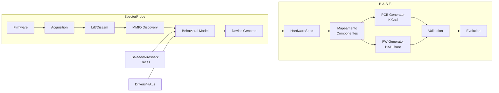

---
tags:
  - architecture
  - overview
---

# Visão Geral da Arquitetura

## Stack de Camadas

```
┌─────────────────────────────────────────────────────────────┐
│                      B.A.S.E. CLI                           │
│              base-cli (interface unificada)                  │
├─────────────────────────────────────────────────────────────┤
│                                                              │
│  ┌─────────────┐  ┌──────────┐  ┌────────┐  ┌───────────┐  │
│  │ base-core   │  │ base-pcb │  │base-fw │  │base-check │  │
│  │ (inferência │  │ (KiCad)  │  │ (FW    │  │(validação)│  │
│  │  + mapeamento)│           │  │  sint.) │  │           │  │
│  └─────────────┘  └──────────┘  └────────┘  └───────────┘  │
│                                                              │
│  ┌─────────────────────────────────────────────────────────┐ │
│  │              base-evolve (upgrade engine)               │ │
│  └─────────────────────────────────────────────────────────┘ │
├─────────────────────────────────────────────────────────────┤
│                    SpecterProbe (fundação)                   │
│  ┌──────────┬──────────┬──────────┬──────────┬──────────┐  │
│  │Acquisition│  Lift   │   MMIO   │Behavior  │  Genome  │  │
│  │  (1)     │  (2)     │   (3)    │  (4)     │   (8)    │  │
│  └──────────┴──────────┴──────────┴──────────┴──────────┘  │
└─────────────────────────────────────────────────────────────┘
```

## Relação com SpecterProbe

| SpecterProbe | B.A.S.E. Equivalente | Status |
|-------------|----------------------|--------|
| Camada 1: Acquisition | Input pipeline | ✅ Completo |
| Camada 2: Lift (LLVM IR) | Input pipeline | ⚠️ IR parcial |
| Camada 3: MMIO Discovery | Input pipeline | ✅ Completo |
| Camada 4: Behavioral | [[02 - Layers/02.02 Inference Engine]] (Stage 1) | ✅ Completo |
| Camada 5: Redox Driver Gen | [[02 - Layers/02.03 HAL Translation]] (inspiração) | ✅ Completo |
| Camada 6: Knowledge Graph | [[03 - Technical Specs/03.02 Behavioral Graph]] (evolução) | ⚠️ Parcial |
| Camada 7: GPU/ISP/DSP Compat | [[02 - Layers/02.02 Inference Engine]] (Stage 2) | ✅ Completo |
| Camada 8: Device Genome | [[03 - Technical Specs/03.01 HardwareSpec Schema]] (base) | ✅ Completo |
| Camada 9: QEMU Device Gen | [[02 - Layers/02.03 HAL Translation]] (complementar) | ✅ Completo |

## Fluxo de Dados



## Decisões Arquiteturais

| Decisão | Escolha | Motivo |
|---------|---------|--------|
| Linguagem | Rust | Performance + segurança + ecossistema SpecterProbe |
| Formato PCB | S-expression KiCad | Formato texto, versionável, bem documentado |
| HAL target | C + Rust (cortex-m) | Bootloader em C, camadas superiores em Rust |
| Validação | Replay de traces | Mensurável, automatizável, comparável |
| Component DB | YAML | Legível por humano, fácil de expandir |
| Pipeline | Síncrono sequencial | Simplicidade, debug fácil (mesmo padrão do SpecterProbe) |
