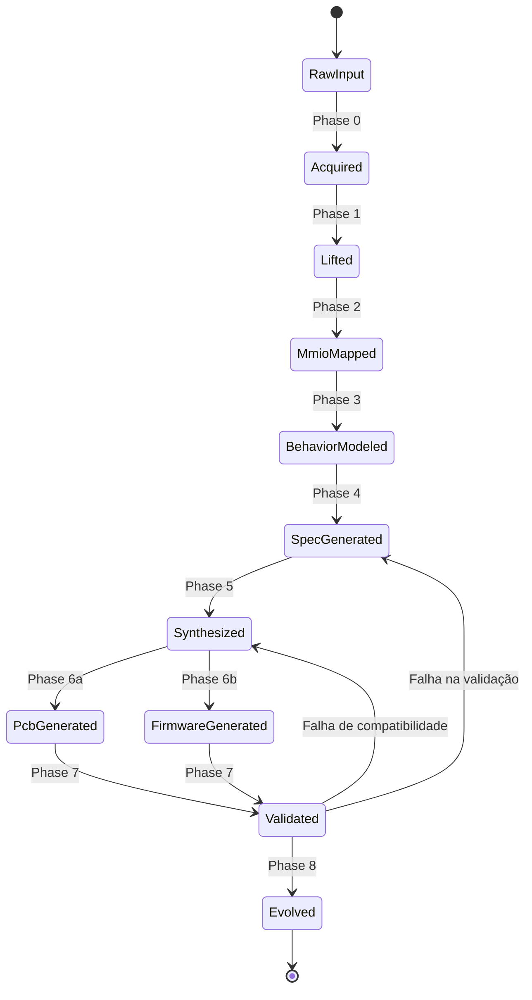

---
tags:
  - architecture
  - pipeline
---

# Pipeline Flow

## Estágios do Pipeline

```
Firmware/ROM/Drivers/Traces
         │
         ▼
┌─────────────────────────────────┐
│    PHASE 0: Aquisição           │ ← SpecterProbe Layer 1
│    (Extrair, descompilar,       │
│     organizar entradas)         │
└──────────────┬──────────────────┘
               │
               ▼
┌─────────────────────────────────┐
│    PHASE 1: Lifting             │ ← SpecterProbe Layer 2
│    (ARM64 → Capstone → CFG      │
│     → LLVM IR)                  │
└──────────────┬──────────────────┘
               │
               ▼
┌─────────────────────────────────┐
│    PHASE 2: MMIO Discovery      │ ← SpecterProbe Layer 3
│    (Endereços, regiões,         │
│     classificação DTB)          │
└──────────────┬──────────────────┘
               │
               ▼
┌─────────────────────────────────┐
│    PHASE 3: Behavioral Model    │ ← SpecterProbe Layer 4
│    (Registradores, FSM,         │
│     protocolos, polling)        │
└──────────────┬──────────────────┘
               │
               ▼
┌─────────────────────────────────┐
│    PHASE 4: Specification       │ ← Genoma YAML
│    (HardwareSpec unificado)     │
└──────────────┬──────────────────┘
               │
               ▼
┌─────────────────────────────────┐
│    PHASE 5: Synthesis            │
│    (Mapear blocos lógicos        │
│     para componentes reais)      │ ← Component DB
└──────────────┬──────────────────┘
               │
       ┌───────┴───────┐
       ▼               ▼
┌────────────┐  ┌────────────┐
│ PHASE 6a: │  │ PHASE 6b: │
│ PCB       │  │ Firmware   │
│ (KiCad)   │  │ (HAL+      │
│            │  │  Bootloader)│
└──────┬─────┘  └──────┬─────┘
       │               │
       └───────┬───────┘
               ▼
┌─────────────────────────────────┐
│    PHASE 7: Validation          │
│    (Comparar original × novo)   │
└──────────────┬──────────────────┘
               │
               ▼
┌─────────────────────────────────┐
│    PHASE 8: Evolution           │
│    (Sugerir upgrades,           │
│     gerar plano migração)       │
└─────────────────────────────────┘
```

## Estados do Pipeline



## Formato de Saída por Estágio

| Estágio | Arquivo(s) | Formato |
|---------|-----------|---------|
| 0 | `firmware_manifest.json` | JSON |
| 1 | `lift_{name}.ll`, `lift_{name}.json` | LLVM IR + JSON |
| 2 | `mmio_{name}.json` | JSON |
| 3 | `behavior_{name}.json` | JSON |
| 4 | `genome_summary.yaml`, `genomes/*.yaml` | YAML |
| 5 | `hardware_spec.yaml` | YAML |
| 6a | `project.kicad_pro`, `project.kicad_sch`, `project.kicad_pcb`, `bom.csv` | KiCad + CSV |
| 6b | `bootloader/`, `hal/`, `drivers/` | C + Rust |
| 7 | `validation_report.html`, `validation_report.json` | HTML + JSON |
| 8 | `evolution_proposal.yaml` | YAML |

## Flags CLI

```bash
# Análise (SpecterProbe)
-l    Lifting (ARM64 → IR)
-m    MMIO Discovery
-b    Behavioral Modeling
-g    Redox Driver Gen
-k    Knowledge Graph
-c    GPU/ISP/DSP Compat
-d    Device Genome
-e    QEMU Device Gen

# Síntese (B.A.S.E.)
--synth       Síntese de hardware (Phase 5)
--pcb         Gerar PCB KiCad (Phase 6a)
--fw          Gerar firmware sintético (Phase 6b)
--check       Validar contra original (Phase 7)
--evolve      Sugerir upgrades (Phase 8)
--target      Plataforma alvo (kicad, rp2350, cortex-a)
```
