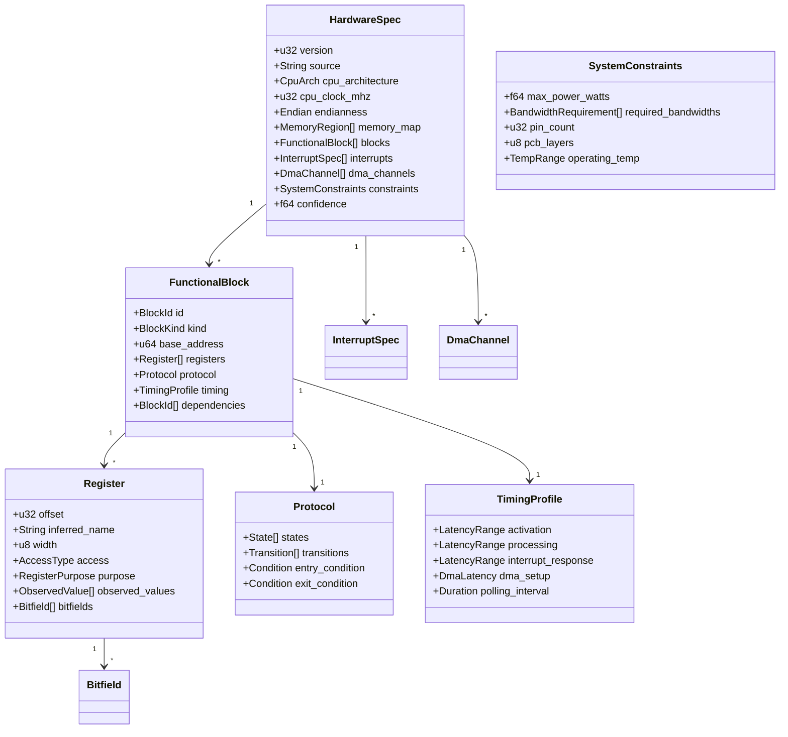

---
tags:
  - architecture
  - data-model
---

# Data Model

## Core Data Structures



## BlockKind Enum

```rust
enum BlockKind {
    Gpu,
    Audio,
    Dma,
    Usb,
    Ethernet,
    Spi,
    I2c,
    Uart,
    Timer,
    InterruptController,
    MemoryController,
    Crypto,
    VideoCodec,
    Isp,
    Npu,
    Unknown,
}
```

## AccessType Enum

```rust
enum AccessType {
    ReadOnly,
    WriteOnly,
    ReadWrite,
    WriteClear,
    WriteToggle,
    ReadDestruct,
}
```

## RegisterPurpose Enum

```rust
enum RegisterPurpose {
    Control,
    Status,
    InterruptMask,
    InterruptStatus,
    AddressPointer,
    DataLength,
    DataPort,
    ClockDivider,
    DmaControl,
    DebugRegister,
    UnknownPurpose,
}
```

## TimingModel

```rust
struct LatencyRange {
    min: Duration,
    max: Duration,
    avg: Duration,
    p99: Duration,
    samples: usize,
}

struct DmaLatency {
    setup: LatencyRange,
    transfer_per_byte: LatencyRange,
    completion: LatencyRange,
}

struct TimingProfile {
    activation_latency: LatencyRange,
    processing_latency: LatencyRange,
    interrupt_response: LatencyRange,
    dma_setup_latency: Option<DmaLatency>,
    polling_interval: Option<Duration>,
}
```

## Serialização (YAML)

```yaml
# hardware_spec.yaml
version: 1
source: "SpecterProbe v0.1 + Saleae trace 2024-03-15"
cpu_architecture: PowerPC
cpu_clock_mhz: 400
endianness: Big
memory_map:
  - base: 0x00000000
    size: 0x08000000
    type: RAM
  - base: 0xFF800000
    size: 0x00800000
    type: ROM

blocks:
  - id: gpu_0
    kind: Gpu
    base_address: 0x10000000
    registers:
      - offset: 0x00
        inferred_name: control
        width: 32
        access: ReadWrite
        purpose: Control
        observed_values:
          - value: 0x00000000
            count: 45
            context: idle
          - value: 0x00000001
            count: 12
            context: wake
      - offset: 0x04
        inferred_name: buf_addr
        width: 32
        access: WriteOnly
        purpose: AddressPointer
    protocol:
      states: [Idle, Ready, Busy, Done]
      transitions:
        - from: Idle
          to: Ready
          condition: { register: control, value: 1 }
    timing:
      activation_latency:
        min: 800ns
        max: 3.1us
        avg: 1.2us
    confidence: 0.87
```
