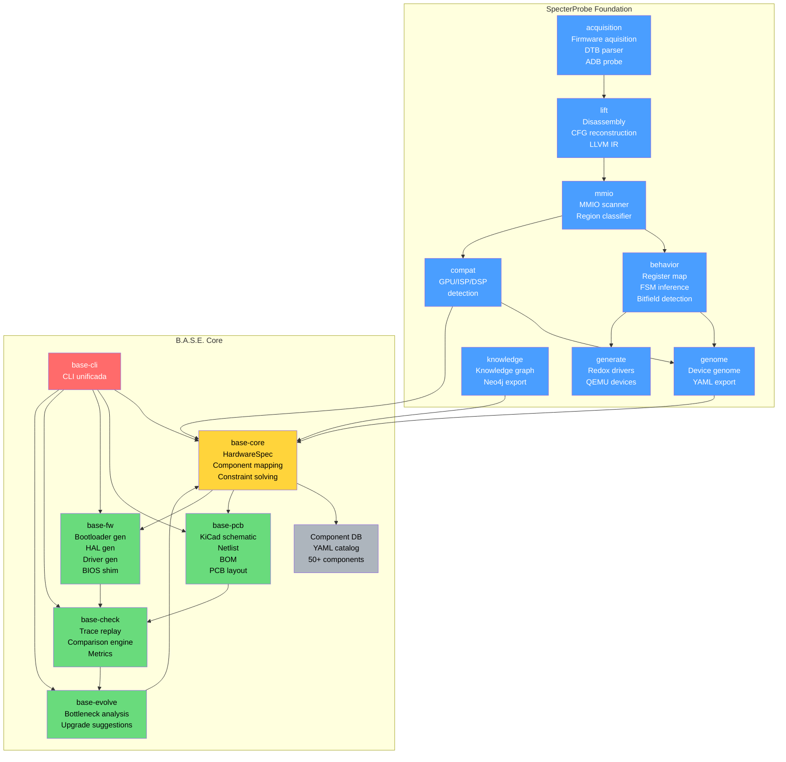
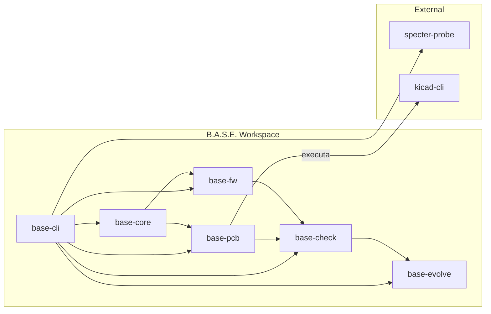

---
tags:
  - architecture
  - diagram
---

# Component Diagram

## Dependências entre Crates

## Tecnologias por Crate

| Crate | Language | Deps Externas | Output |
|-------|----------|--------------|--------|
| base-core | Rust | serde, petgraph, clap | YAML/JSON |
| base-pcb | Rust | serde | .kicad_sch, .kicad_pcb, BOM |
| base-fw | Rust | serde | .c, .rs, Makefile |
| base-check | Rust | serde, csv, plotters | .html, .json |
| base-evolve | Rust | serde | .yaml |
| base-cli | Rust | clap, base-* | CLI |
