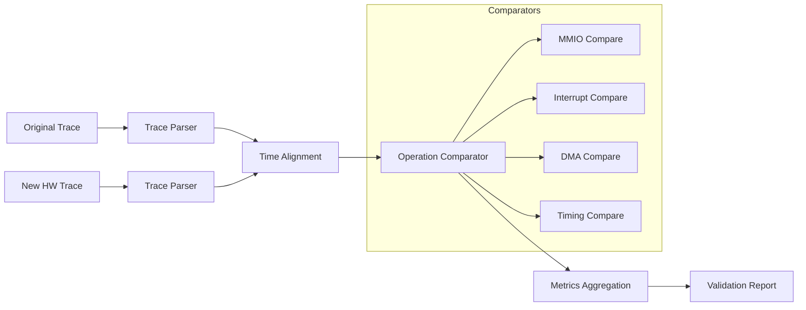

---
tags:
  - layer
  - validation
---

# Validation Engine (base-check)

## Pipeline de Validação



## Trace Parser

```rust
struct FlowParser {
    format: TraceFormat,
}

enum TraceFormat {
    SaleaeCsv,      // Time[s], Channel, Type, Data
    PulseView,      // Sigrok format
    WiresharkPcap,  // Network captures
    CustomJson,     // Generic JSON trace
    LogFile,        // dmesg / uart log
}

impl FlowParser {
    fn parse(&self, path: &Path) -> Result<DeviceTrace> {
        match self.format {
            TraceFormat::SaleaeCsv => {
                let mut rdr = csv::Reader::from_path(path)?;
                let mut events = Vec::new();
                for result in rdr.deserialize() {
                    let row: SaleaeRow = result?;
                    events.push(self.row_to_event(row));
                }
                Ok(DeviceTrace { events, source: path.to_string_lossy().to_string() })
            }
            TraceFormat::CustomJson => {
                let file = File::open(path)?;
                Ok(serde_json::from_reader(file)?)
            }
        }
    }
}
```

## Operation Comparator

```rust
struct OperationComparator {
    spec: HardwareSpec,
    thresholds: ValidationThresholds,
}

impl OperationComparator {
    fn compare(&self, original: &DeviceTrace, actual: &DeviceTrace) -> Vec<ComparisonItem> {
        let aligned = self.align_traces(original, actual);
        
        aligned.into_iter().map(|(orig, act)| {
            let mmio_pass = self.compare_mmio(&orig, &act);
            let timing_pass = self.compare_timing(&orig, &act);
            let irq_pass = self.compare_interrupts(&orig, &act);
            
            ComparisonItem {
                operation_id: orig.id,
                original_address: orig.address,
                new_address: act.address,
                original_value: orig.value,
                actual_value: act.value,
                latency_ratio: act.timestamp.as_secs_f64() / orig.timestamp.as_secs_f64(),
                passed: mmio_pass && timing_pass && irq_pass,
                failures: vec![
                    if !mmio_pass { "MMIO_MISMATCH" } else { "" },
                    if !timing_pass { "TIMING_VIOLATION" } else { "" },
                    if !irq_pass { "IRQ_MISMATCH" } else { "" },
                ].into_iter().filter(|s| !s.is_empty()).collect(),
            }
        }).collect()
    }
}
```

## Relatório de Validação

```markdown
# Validation Report: Power Mac G5 → NeoG5

## Summary

| Métrica | Valor | Status |
|---------|-------|--------|
| Overall Pass Rate | 96.3% | ✅ |
| MMIO Operations | 1,234/1,280 (96.4%) | ✅ |
| DMA Transfers | 45/46 (97.8%) | ✅ |
| Interrupts | 312/312 (100%) | ✅ |
| Timing Compliance | 93.2% | ⚠️ |

## Timing Profile

| Operação | Original | Novo | Ratio | Status |
|----------|----------|------|-------|--------|
| GPU Wake | 2.1µs | 0.8µs | 0.38x | ⚠️ Fast |
| GPU Transfer | 4.2ms | 3.1ms | 0.74x | ✅ |
| DMA Setup | 1.5µs | 2.1µs | 1.40x | ✅ |
| Audio Latency | 5.0ms | 4.2ms | 0.84x | ✅ |
| Interrupt Resp. | 2.3µs | 1.1µs | 0.48x | ⚠️ Fast |

## Warnings

1. GPU wake é 2.6x mais rápido. Pode quebrar polling loops.
   → Delay artificial de 1.5µs inserido pela HAL.

2. DMA setup é 40% mais lento. Dentro da tolerância (2x).

## Failures

| # | Operação | Endereço | Esperado | Obtido | Causa |
|---|----------|----------|----------|--------|-------|
| 1 | MMIO Write | 0x10010010 | 0x01 | 0x03 | Bitfield bit[1] não implementado |
| 2 | DMA Read | - | OK | Checksum | Padding de 64 bytes necessário |
```

## Métricas e Limiares

```rust
struct ValidationThresholds {
    max_latency_ratio: f64,        // 2.0 = 2x mais lento OK
    min_value_accuracy: f64,       // 0.95 = 95%
    max_missing_interrupts: f64,   // 0.05 = 5%
    min_dma_throughput_ratio: f64, // 0.8 = 80% do original
    min_fps_ratio: f64,            // 0.75 = 75% dos FPS originais
}

impl Default for ValidationThresholds {
    fn default() -> Self {
        Self {
            max_latency_ratio: 2.0,
            min_value_accuracy: 0.95,
            max_missing_interrupts: 0.05,
            min_dma_throughput_ratio: 0.8,
            min_fps_ratio: 0.75,
        }
    }
}
```

## Modos de Validação

| Modo | Requer HW Real? | Velocidade | Cobertura |
|------|----------------|------------|-----------|
| **Static analysis** | Não | Segundos | Estrutural (registros, barramentos) |
| **Trace replay (simulado)** | Não | Minutos | Comportamental (MMIO, DMA, IRQ) |
| **Trace replay (hardware)** | Sim | Horas | Timing real, interferências |
| **Boot test** | Sim | Minutos | POST, inicialização |
| **Application benchmark** | Sim | Horas | FPS, latência áudio, throughput |
