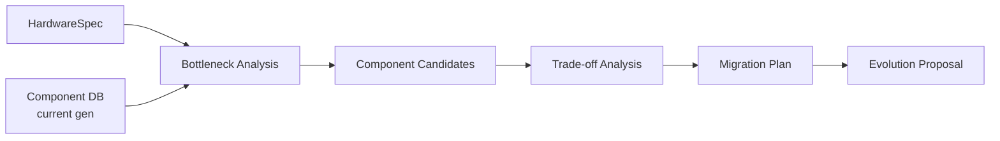

---
tags:
  - layer
  - evolution
---

# Evolution Engine (base-evolve)

## Conceito

Após validar que o novo hardware replica o comportamento do original, o motor de evolução sugere **upgrades modernos** mantendo compatibilidade.

## Pipeline



## Bottleneck Analysis

```rust
struct Bottleneck {
    block_id: BlockId,
    component: String,
    bottleneck_type: BottleneckType,
    current_perf: f64,
    candidate_perf: f64,
    improvement: f64,
}

enum BottleneckType { Bandwidth, Latency, Capacity, Power, Cost, Availability }

fn analyze_bottlenecks(spec: &HardwareSpec, db: &ComponentDb) -> Vec<Bottleneck> {
    let mut bottlenecks = Vec::new();
    
    if let Some(cpu) = &spec.cpu_assignment {
        let modern_cpus = db.search("cpu", "performance >", cpu.performance * 2.0);
        if let Some(best) = modern_cpus.first() {
            bottlenecks.push(Bottleneck {
                block_id: BlockId::Cpu,
                component: cpu.part.clone(),
                bottleneck_type: BottleneckType::Bandwidth,
                current_perf: cpu.performance,
                candidate_perf: best.performance,
                improvement: best.performance / cpu.performance,
            });
        }
    }
    
    if let Some(mem) = &spec.memory {
        let modern_mem = db.search("memory", "type", "ddr5");
        if let Some(best) = modern_mem.first() {
            let bw_improvement = best.bandwidth_mbps / mem.bandwidth_mbps;
            if bw_improvement > 2.0 {
                bottlenecks.push(Bottleneck {
                    block_id: BlockId::Memory,
                    component: mem.type_.clone(),
                    bottleneck_type: BottleneckType::Bandwidth,
                    current_perf: mem.bandwidth_mbps,
                    candidate_perf: best.bandwidth_mbps,
                    improvement: bw_improvement,
                });
            }
        }
    }
    
    bottlenecks.sort_by(|a, b| b.improvement.partial_cmp(&a.improvement).unwrap());
    bottlenecks
}
```

## Trade-off Analysis

```rust
struct Tradeoff {
    component: String,
    original: String,
    candidate: String,
    pros: Vec<String>,
    cons: Vec<String>,
    cost_delta: f64,
    complexity_increase: Complexity,
    risk: Risk,
}

enum Complexity { Same, SlightlyMore, SignificantlyMore }
enum Risk { Low, Medium, High }
```

## Migration Plan

```yaml
# evolution_proposal.yaml
title: "NeoG5: Power Mac G5 modernizado"
summary: "Substitui componentes originais por equivalentes modernos"

changes:
  - component: "CPU"
    original: "PowerPC 970MP @ 2.5GHz"
    replacement: "Cortex-X4 @ 3.4GHz"
    speedup: 3.2x
    bom_delta: +$45.00
    requires_pcb_change: true
    requires_fw_change: true
    risk: medium
    
  - component: "Memory"
    original: "DDR1-400 @ 4GB"
    replacement: "DDR5-6400 @ 32GB"
    speedup: 8.0x (bandwidth)
    bom_delta: +$35.00
    requires_pcb_change: true
    requires_fw_change: false
    risk: low
    
  - component: "Storage"
    original: "SATA @ 150MB/s"
    replacement: "NVMe @ 7GB/s"
    speedup: 46.7x
    bom_delta: +$25.00
    requires_pcb_change: true
    requires_fw_change: true
    risk: low
    
  - component: "Network"
    original: "1Gbps Ethernet"
    replacement: "10Gbps Ethernet"
    speedup: 10x
    bom_delta: +$30.00
    requires_pcb_change: true
    requires_fw_change: true
    risk: low

estimated_bom: "$180.00 (+$135.00 vs original B.A.S.E.)"
estimated_power: "45W (-60% vs original 115W)"
compatibility: "100% comportamental. Drivers de rede precisam de update."

migration_steps:
  - step: 1
    action: "PCB respin — novo footprint CPU + DDR5 + NVMe + 10GbE"
    effort: "2 semanas"
  - step: 2
    action: "HAL update — novos timings de memória"
    effort: "3 dias"
  - step: 3
    action: "Firmware update — drivers NVMe + 10GbE"
    effort: "1 semana"
```
