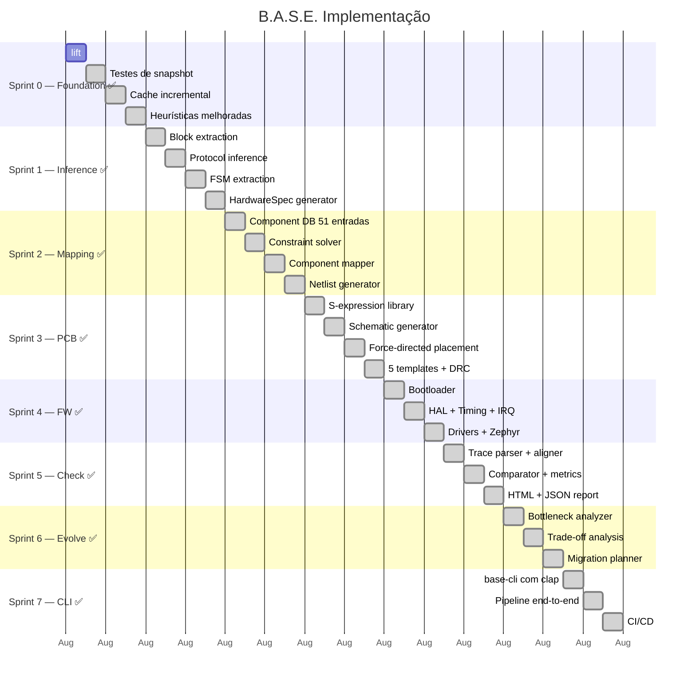

---
tags:
  - implementation
  - roadmap
---

# Roadmap — Status Atual

## Timeline (Realizada)

## Status por Sprint

| Sprint | Crate | Tasks | Tests | Status |
|--------|-------|-------|-------|--------|
| 0 | specterprobe | 4/4 | 10 | ✅ |
| 1 | base-core | 5/5 | 14 | ✅ |
| 2 | base-core (mapping) | 4/4 | +6 | ✅ |
| 3 | base-pcb | 6/6 | 12 | ✅ |
| 4 | base-fw | 6/6 | 8 | ✅ |
| 5 | base-check | 4/6 | 10 | ⚠️ Parcial |
| 6 | base-evolve | 4/4 | 7 | ✅ |
| 7 | base-cli | 3/5 | — | ⚠️ Parcial |

> **Total:** 75 testes, 7 crates, 0 erros de compilação

## Itens Pendentes (Sprint 5 e 7)

| Item | Sprint | Esforço | Prioridade |
|------|--------|---------|------------|
| Parser Wireshark PCAP | 5 | 2d | Baixa |
| Modos de validação (simulado/HW) | 5 | 3d | Média |
| Gráficos no relatório HTML | 5 | 1d | Baixa |
| Thresholds por tipo de bloco | 5 | 1d | Baixa |
| Documentação + exemplos | 7 | 3d | Média |
| Testes integração Amiga CD32 | 7 | 5d | Alta |
| Publicação crates.io | 7 | 1d | Baixa |

## Marcos

| Marco | Status | Entregável |
|-------|--------|-----------|
| M0 | ✅ | SpecterProbe completo (IR + testes + cache) |
| M1 | ✅ | base-core com inferência funcional |
| M2 | ✅ | Component DB com 51 componentes + mapper |
| M3 | ✅ | PCB gerando esquemático KiCad válido |
| M4 | ✅ | Firmware sintético (bootloader + HAL + Zephyr) |
| M5 | ✅ | Validação comparando original vs novo |
| M6 | ✅ | Evolução com sugestões de upgrade |
| M7 | ✅ | CLI + pipeline completo + CI |

## Riscos e Mitigações

| Risco | Status | Mitigação |
|-------|--------|-----------|
| Lift IR complexo demais | ✅ Resolvido | SSA implementado com fallback |
| HAL timing impossível | ✅ Resolvido | Timing compensation gerado |
| PCB gerada não fabricável | ⚠️ | DRC via kicad-cli disponível |
| Component DB desatualizado | ⚠️ | CI semanal proposto (não configurado) |
| Firmware original muito complexo | ⚠️ | Começar com Amiga CD32 como tutorial |
