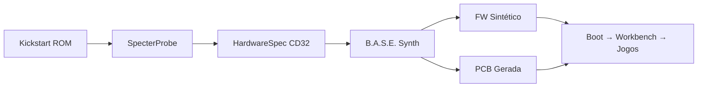

---
tags:
  - use-case
  - amiga
---

# Use Case: Amiga CD32

## Sistema Original

| Componente | Especificação |
|------------|--------------|
| CPU | Motorola 68EC020 @ 14MHz |
| Chipset | AGA (Alice, Lisa, Paula, Gayle) |
| Áudio | Paula (4× 8-bit PCM, 28kHz) |
| Storage | CD-ROM (2x) |
| RAM | 2MB Chip + 1MB Fast |
| OS | AmigaOS 3.1 (Kickstart ROM) |

## Por que é o melhor primeiro caso

1. **Simplicidade**: Single CPU, sem MMU, sem cache
2. **Documentação Pública**: Esquemas e datasheets disponíveis
3. **Firmware ROM**: Kickstart extraível
4. **Baixa Frequência**: 14MHz → fácil de emular com MCU moderno
5. **Comunidade Ativa**: Cena de preservação forte
6. **AGA Chipset bem documentado**: Alice (video), Lisa (display), Paula (audio/IO), Gayle (chip select)

## Alvo B.A.S.E.

| Função | Componente B.A.S.E. |
|--------|--------------------|
| CPU | RP2350 M33 @ 150MHz (~10× mais rápido) |
| Chipset AGA | RP2350 PIO + DMA para framebuffer |
| Áudio Paula | RP2350 PWM + I2S DAC (PCM5102A) |
| CD-ROM | SPI SD Card (emula CD) |
| RAM | RP2350 SRAM (520KB) + PSRAM externa (8MB) |
| Joystick | GPIO com pull-ups |
| Video | Via PIO + resistor DAC (RGB to HDMI)

## Plano de Implementação

## Etapas

1. Extrair Kickstart ROM do CD32
2. Rodar SpecterProbe para mapear MMIO do chipset AGA (Alice: 0xDFF000, Lisa: 0xDFF100, Paula: 0xDFF000)
3. Identificar registradores: `color[0..31]` ($180-$1FC), `bplcon0` ($100), `dmacon` ($096)
4. Gerar HAL que traduz acessos aos chips Alice/Lisa/Paula
5. Implementar Paula Audio via PIO: 4 canais, 8-bit, 28kHz, DMA circular
6. Implementar framebuffer AGA via PIO + DMA: 1280×256, 64 cores
7. Implementar CD-ROM → SD Card via SPI com tradução de comandos
8. Gerar PCB com RP2350 + PSRAM + PCM5102A + SD slot
9. Validar com jogos originais: Super Stardust, Wings, Alien Breed

Veja também: [[06 - Use Cases/06.01 Power Mac G5]] (caso complexo)
