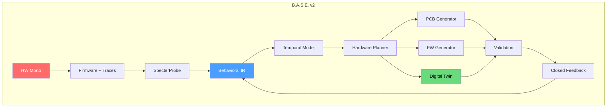
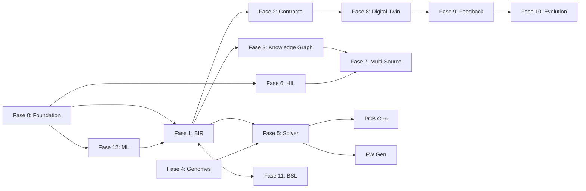

# B.A.S.E. v2 — Universal Hardware Reconstruction System

> *Deixar de ser um gerador de PCB. Virar um sistema operacional para arqueologia e síntese de hardware.*

## As 12 Fases

| # | Fase | Status | Essência |
|---|------|--------|----------|
| 0 | [[09.00 - Foundation\|Foundation]] | ✅ Planejada | Schema versionado, crates base, integração Z3 |
| 1 | [[09.01 - Behavioral IR\|Behavioral IR (BIR)]] | 📝 Pendente | O LLVM IR do hardware |
| 2 | [[09.02 - Temporal Contracts\|Temporal Contract Engine]] | 📝 Pendente | Modelar tempo, não apenas funções |
| 3 | [[09.03 - Knowledge Graph\|Behavioral Knowledge Graph]] | 📝 Pendente | Abandonar YAML, tudo vira grafo |
| 4 | [[09.04 - Genomes DB\|Hardware Genome Database]] | 📝 Pendente | Base de conhecimento massiva |
| 5 | [[09.05 - Constraint Solver\|Constraint Solver (Z3 + ILP)]] | 📝 Pendente | O cérebro do sistema |
| 6 | [[09.06 - HIL Cluster\|HIL Cluster]] | 📝 Pendente | Rede de captura multi-protocolo |
| 7 | [[09.07 - Multi-Source Learning\|Multi-Source Learning]] | 📝 Pendente | Fusão de firmware, drivers, traces |
| 8 | [[09.08 - Digital Twin\|Digital Twin]] | 📝 Pendente | Executar HW virtualmente |
| 9 | [[09.09 - Feedback Loop\|Closed Feedback Loop]] | 📝 Pendente | Pipeline recursivo |
| 10 | [[09.10 - Evolution Engine\|Evolution Engine]] | 📝 Pendente | Evoluir, não reconstruir |
| 11 | [[09.11 - BSL Language\|BSL Language]] | 📝 Pendente | A linguagem do ecossistema |
| 12 | [[09.12 - Foundation Models\|Behavioral Foundation Models]] | 📝 Pendente | ML especializado para HW |

## Decisões Arquiteturais

| Decisão | Escolha | Impacto |
|---------|---------|---------|
| Constraint Solver | **Híbrido Z3 + ILP** | `z3.rs` para SAT/SMT, `good_lp` para otimização |
| BIR/BSL | **DSL desde o início** | `pest` para parser, YAML como serialização secundária |
| HIL Probe | **Rust (rp-hal)** | Firmware mesmo ecossistema, `probe-rs` para debug |

## Diagrama de Dependências

## Esforço Total

| Fase | Semanas | Risco |
|------|---------|-------|
| 0-4 | ~19 | Médio |
| 5-8 | ~28 | Alto |
| 9-12 | ~26 | Muito Alto |
| **Total** | **~73 semanas** | |

[[00 - Index]] ← Voltar ao índice principal
