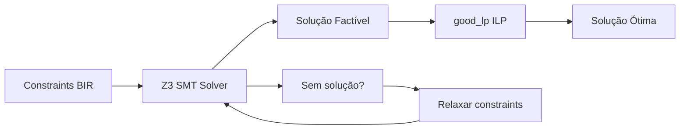

---
tags:
  - v2
  - solver
---

# Fase 5 — Constraint Solver (Z3 + ILP)

**Esforço:** 8 semanas | **Risco:** Alto | **Inovação:** ★★★★★

> O cérebro do sistema. Híbrido Z3 (SMT) para constraints lógicas + ILP para otimização de custo.

## Arquitetura



## Tarefas

- [ ] Integrar `z3` crate (bindings Rust para Z3 prover)
- [ ] Integrar `good_lp` (Mixed-Integer Linear Programming)
- [ ] Tradutor de constraints BIR → SMT-LIB para Z3
- [ ] Tradutor de otimização de custo → ILP (good_lp)
- [ ] Orquestrador híbrido
- [ ] Interface declarativa de constraints
- [ ] Cache de soluções
- [ ] Testes com 50+ problemas sintéticos

## Tradutor BIR → SMT-LIB

```lisp
; BIR constraint para Z3
(declare-const cpu String)
(declare-const ram String)

; CPU deve ter DMA
(assert (has-peripheral cpu "dma"))

; RAM deve ter ≥ 8MB
(assert (>= (memory-size ram) 8388608))

; Custo total ≤ $50
(assert (<= (+ (cost cpu) (cost ram)) 50))

; Potência total ≤ 5W
(assert (<= (+ (power cpu) (power ram)) 5))

(check-sat)
(get-model)
```

## Tradutor BIR → ILP (good_lp)

```rust
use good_lp::{variable, variables, Solution, Solver};

fn optimize_bom(components: &[Component], budget: f64) -> Option<f64> {
    variables! {
        vars:
            0 <= x[i] <= 1 for i in components;  // binary: selected or not
    }

    let cost: Expression = components.iter()
        .zip(&vars)
        .map(|(c, v)| c.price * v)
        .sum();

    // Minimizar custo sujeito a:
    // 1. Pelo menos 1 CPU selecionada
    // 2. Pelo menos 1 memória selecionada
    // 3. Custo total ≤ budget
    let solution = vars.minimise(cost)
        .using(DefaultSolver)
        .with(Constraint::from(components.iter()
            .filter(|c| c.category == "cpu")
            .zip(&vars)
            .map(|(_, v)| v)
            .sum::<Expression>()) >= 1)
        .solve()
        .ok()?;

    Some(solution.eval(&cost))
}
```

## Interface Declarativa

```bsl
constraints {
    cost_max:     50;      // USD
    power_max:    5W;      // watts
    layers_max:   4;       // PCB layers
    availability: high;    // stock preference
    size_max:     50x30mm; // board dimensions
}
```

```bash
# Uso na CLI
base solve hardware_spec.yaml --optimize cost --budget 50
base solve hardware_spec.yaml --optimize power --max-watts 5
base solve hardware_spec.yaml --optimize layers
```

[[09.00 - Index]]
