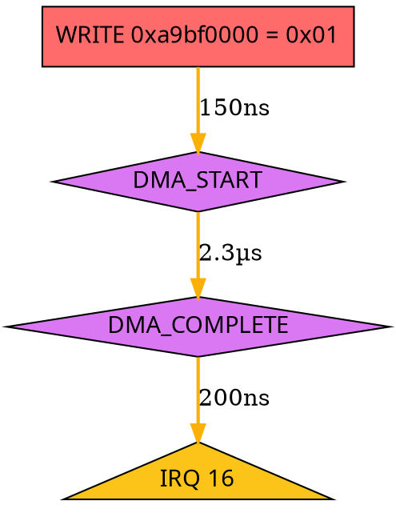
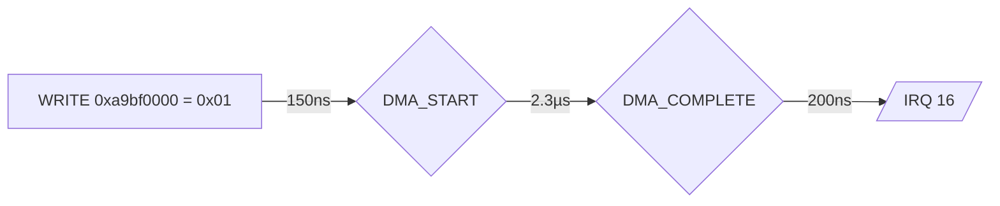

---
tags:
  - v3
  - graph
updated: 2026-07-15
status: partial
---

# Passo 10 — Event Graph

**Status (R2):** `base event-graph` → DOT/Mermaid. Goldens: `examples/pilot/expected/event_graph.*`

> *Grafo causal de eventos, não conexões estruturais.*

## Problema

Hoje o `behavior_graph.dot` mostra:

```text
CPU ──MMIO──► GPU ──reg──► CONTROL
```

Isso é **estrutural**. Mostra quem conversa com quem, mas não o que acontece.

## Solução

```text
WRITE(0x10000000, 1)
  ↓ 150ns
DMA_START
  ↓ 2.3µs
DMA_COMPLETE
  ↓ 200ns
IRQ_GPU
```

## Event Graph

```rust
struct EventGraph {
    nodes: Vec<EventNode>,
    edges: Vec<CausalEdge>,
}

struct EventNode {
    id: String,
    label: String,
    kind: EventKind,         // Write, Read, DmaStart, Irq, etc
    timestamp_ns: u64,
}

enum EventKind {
    MmioWrite { address: u64, value: u64 },
    MmioRead  { address: u64 },
    DmaStart,
    DmaComplete,
    Irq { vector: u8 },
}

struct CausalEdge {
    from: String,
    to: String,
    latency_ns: u64,
    confidence: f64,
}
```

## Export DOT



## Export Mermaid



[[11.00 - Index]]
