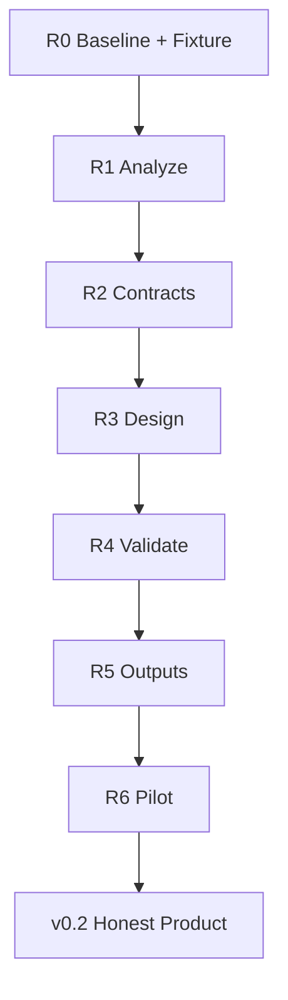

# 12 — Path to Real

> *Do demo scaffold ao produto auditável: evidência → contratos → design → validação.*

**Objetivo:** tornar B.A.S.E. *honestamente útil* — não um gerador mágico de ASIC, mas um pipeline que um engenheiro pode confiar para analisar firmware e produzir um **Reference Design + prova/replay**.

**Status:** v0.2 ✅ (R0–R6). **Próximo plano:** [[13 - Path to v0.3/13.00 - Index|13 — Path to v0.3]].

## Ponto de partida (pós-audit 2026-07)

| Camada | Estado |
|--------|--------|
| analyze / evidence / replay / prove / design / check / fw host | ✅ REAL* no wedge piloto |
| pcb KiCad / evolve | SCAFFOLD rotulado / opt-in |
| Claim “firmware → PCB drop-in” | 🚫 Fora do escopo v0.2 |

## Mapa desta seção

| Nota | Papel |
|------|-------|
| [[12.01 - Master Plan\|📌 Master Plan]] | Nota-mestre: visão, fases, métricas, anti-overclaim |
| [[12.02 - Maturity Matrix\|📊 Maturity Matrix]] | Realidade comando a comando + DoD |
| [[12.03 - Acceptance Criteria\|✅ Acceptance Criteria]] | Critérios mensuráveis por artefato |
| [[12.04 - Sprint Board\|📋 Sprint Board]] | Kanban R0–R6 (todo/doing/done) |
| [[12.05 - Architectures\|🖥️ Architectures]] | Capstone / heuristic / mmio-traces |
| [[12.10 - Sprint R0 Baseline\|R0]] | Congelar honestidade + fixture real |
| [[12.11 - Sprint R1 Analyze\|R1]] | Analyze + Evidence + classify estáveis |
| [[12.12 - Sprint R2 Contracts\|R2]] | BIR → contratos → replay → prove |
| [[12.13 - Sprint R3 Design\|R3]] | Reference Design + solver + BOM |
| [[12.14 - Sprint R4 Validate\|R4]] | Check / HIL / report auditável |
| [[12.15 - Sprint R5 Outputs\|R5]] | FW host-CI + PCB draft honesto |
| [[12.16 - Sprint R6 Pilot\|R6]] | 1 firmware piloto documentado ✅ |
| [[12.20 - Pilot Case Study\|🧪 Pilot Case Study]] | Case study v0.2 (wedge UART) |

## Fluxo do plano

## Princípio guia

1. **Um wedge estreito** first (MCU/SoC ARM com MMIO claro).
2. **Artefatos auditáveis** > features da CLI.
3. **Labels honestos**: `engineering_draft` ≠ `fabricable`.
4. Cada sprint fecha com **fixture + teste + nota no vault**.

## Links

- [[00 - Index]] · [[05 - Implementation/05.01 Roadmap]] · [[11 - B.A.S.E. v3.2 Scientific/11.00 - Index]]
- Código: `base-cli`, `base-core`, `specterprobe`
