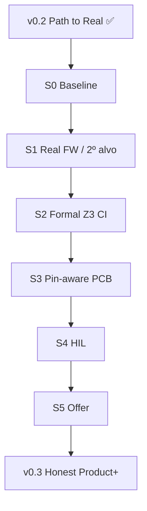

# 13 — Path to v0.3

> *Do wedge UART auditável ao produto multi-alvo com prova formal, HIL e PCB pin-aware — sem overclaim.*

**Herdado de:** [[12 - Path to Real/12.00 - Index|Path to Real v0.2]] ✅  
**Case study base:** [[12 - Path to Real/12.20 - Pilot Case Study]]

## Norte v0.3

| É | Não é |
|---|--------|
| Segundo alvo ou FW real no mesmo padrão MMIO | ASIC drop-in genérico |
| Z3 na CI (nightly / feature) | “Prova formal universal” |
| PCB com pinout mínimo tipado | Gerber fabricável |
| HIL template + 1 probe path | Loop HIL em todos os boards |
| Oferta forense robusta + industrial sob SOW | SaaS turnkey sem humano |

## Mapa desta seção

| Nota | Papel |
|------|-------|
| [[13.01 - Master Plan\|📌 Master Plan v0.3]] | Norte, fases L4–L6, métricas, anti-padrões |
| [[13.02 - Maturity Delta\|📊 Maturity Delta]] | O que sobe de Maturity vs v0.2 |
| [[13.03 - Acceptance Criteria\|✅ Acceptance]] | DoD por artefato novo |
| [[13.04 - Sprint Board\|📋 Sprint Board]] | Kanban S0–S5 |
| [[13.10 - Sprint S0 Baseline\|S0]] | Congelar v0.2 + branch strategy |
| [[13.11 - Sprint S1 Real FW\|S1]] | FW realista / 2º alvo |
| [[13.12 - Sprint S2 Formal\|S2]] | Z3 CI + prove upgrade |
| [[13.13 - Sprint S3 Pins\|S3]] | PCB pin-aware |
| [[13.14 - Sprint S4 HIL\|S4]] | base-hil template |
| [[13.15 - Sprint S5 Offer\|S5]] | Docs comerciais + demo industrial |

## Fluxo

## Princípio guia

1. **Não reabrir R*** — v0.2 fica congelado como baseline de regressão (`examples/pilot/run.sh`).
2. **Um incremento por sprint** — preferir prova no wedge antigo + fixture nova.
3. **Mesma honestidade** — Maturity Matrix continua sendo a fonte da verdade.

[[12 - Path to Real/12.00 - Index]] ← Anterior · [[13.01 - Master Plan]] →
