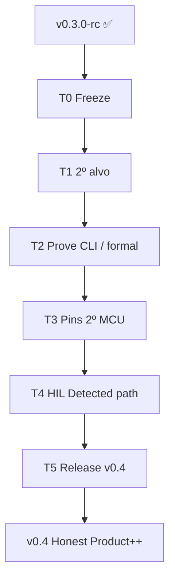

# 14 — Path to v0.4

> *Do rc auditável ao segundo alvo + loop HIL honesto — sem reabrir overclaims.*

**Herdado de:** [[13 - Path to v0.3/13.00 - Index|Path to v0.3]] ✅ · tag git `v0.3.0-rc`  
**Baseline de regressão:** `./examples/pilot/run.sh` / `run_v03.sh` (intocável como gate)

## Norte v0.4

| É | Não é |
|---|--------|
| 2º alvo / arch no mesmo padrão Evidence→Design | ASIC drop-in genérico |
| HIL com path Detected documentado (ou probe-rs stub) | “Flash sozinho na CI” |
| Pins / contratos noutro MCU do wedge | Gerber fabricável |
| Prove report com backend flag na CLI | Z3 no `cargo test` default |
| Oferta forense + 1 SOW piloto assinado | SaaS turnkey |

## Mapa

| Nota | Papel |
|------|-------|
| [[14.01 - Master Plan\|📌 Master Plan v0.4]] | Norte L7–L9, sprints T0–T5 |
| [[14.02 - Maturity Delta\|📊 Maturity Delta]] | Deltas vs v0.3 |
| [[14.03 - Acceptance Criteria\|✅ Acceptance]] | DoD por artefato |
| [[14.04 - Sprint Board\|📋 Sprint Board]] | Kanban T0–T5 |

## Fluxo

## Princípio guia

1. **Não quebrar o piloto UART** — gate permanente.
2. **Um novo eixo por vez** — 2º alvo **ou** HIL real, não três arches.
3. **Detected ≠ CI verde sem hardware** — testes de flash só com feature/`#[ignore]` / job manual.

[[13 - Path to v0.3/13.00 - Index]] ← Anterior · [[14.01 - Master Plan]] →
