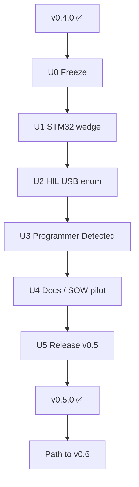

# 15 — Path to v0.5

> *Segundo SoC real + HIL USB tipado — sem reabrir overclaims de fabricabilidade.*

**Herdado de:** [[14 - Path to v0.4/14.00 - Index|Path to v0.4]] ✅ · tag git `v0.4.0`  
**Status:** Path to v0.5 **U0–U5 done** · tag git **`v0.5.0`** (promovido de `v0.5.0-rc`).  
**Segue:** [[16 - Path to v0.6/16.00 - Index|Path to v0.6]] · [CHANGELOG](../../../CHANGELOG.md)  
**Baseline de regressão:** `./examples/pilot/run.sh` + `./examples/pilot/run_t1_b2.sh`

## Norte v0.5

| É | Não é |
|---|--------|
| Wedge STM32 (ou equivalente) no padrão Evidence→Design | ASIC drop-in |
| Enumerate USB / CMSIS-DAP sob feature opt-in | Flash na CI default |
| Programador Detected documentado (ainda EXPERIMENTAL) | HIL “production” |
| Prove/Z3 UX estável | Z3 no `cargo test` workspace |
| Release notes contínuas | SaaS turnkey |

## Mapa

| Nota | Papel |
|------|-------|
| [[15.01 - Master Plan\|📌 Master Plan v0.5]] | Norte L10–L12, sprints U0–U5 |
| [[15.02 - Maturity Delta\|📊 Maturity Delta]] | Deltas vs v0.4 |
| [[15.03 - Acceptance Criteria\|✅ Acceptance]] | DoD |
| [[15.20 - Forensic Playbook\|📖 Playbook v0.5]] | Demo forense RP + STM32 + HIL limits |
| [[15.21 - SOW Industrial Checklist\|📋 SOW v0.5]] | Checklist industrial (humano no loop) |

## Fluxo

## Princípio guia

1. **Não quebrar** `run.sh` / `run_t1_b2.sh`.
2. **USB/HIL** só sob feature ou job opt-in — nunca no CI default.
3. **Um SoC novo por vez** (default: STM32 USART = ex-B1).

[[14 - Path to v0.4/14.00 - Index]] ← Anterior · [[16 - Path to v0.6/16.00 - Index]] →