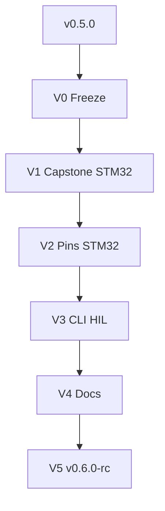

# 16 — Path to v0.6

> *v0.5 estável + STM32 Capstone/pins auditáveis + `base hil` EXPERIMENTAL na CLI — ainda consultoria.*

**Herdado de:** [[15 - Path to v0.5/15.00 - Index|Path to v0.5]] ✅ · tag git `v0.5.0`  
**Status:** Path to v0.6 **V0–V5 done** · tag git **`v0.6.0-rc`**.  
**Baseline de regressão:** `./examples/pilot/run.sh` + `./examples/pilot/run_t1_b2.sh` (+ `pilot_stm32` opt-in)

## Norte v0.6

| É | Não é |
|---|--------|
| STM32 com Capstone/disasm no wedge USART1 | ASIC drop-in |
| Pins STM32 + labels USART no draft sch | PCB fabricável |
| `base hil` thin CLI EXPERIMENTAL | HIL production / flash na CI default |
| Docs sync (playbook/SOW) | SaaS turnkey |
| Amiga/CD32 | wedge de release (fica example de pesquisa) |

## Mapa

| Nota | Papel |
|------|-------|
| [[16.01 - Master Plan\|Master Plan v0.6]] | Norte L13–L15, sprints V0–V5 |
| [[16.02 - Maturity Delta\|Maturity Delta]] | Deltas vs v0.5 |
| [[16.03 - Acceptance Criteria\|Acceptance]] | DoD |
| [[16.04 - Sprint Board\|Sprint Board]] | Kanban V0–V5 |
| [[16.20 - Forensic Playbook\|Playbook v0.6]] | Demo forense |
| [[16.21 - SOW Industrial Checklist\|SOW v0.6]] | Checklist industrial |

## Fluxo

## Princípio guia

1. **Não quebrar** `run.sh` / `run_t1_b2.sh`.
2. **USB/HIL** só sob feature ou job opt-in — nunca no CI default.
3. **Não** promover Amiga/CD32 a wedge de release neste Path.

[[15 - Path to v0.5/15.00 - Index]] ← Anterior · [[16.01 - Master Plan]] →
