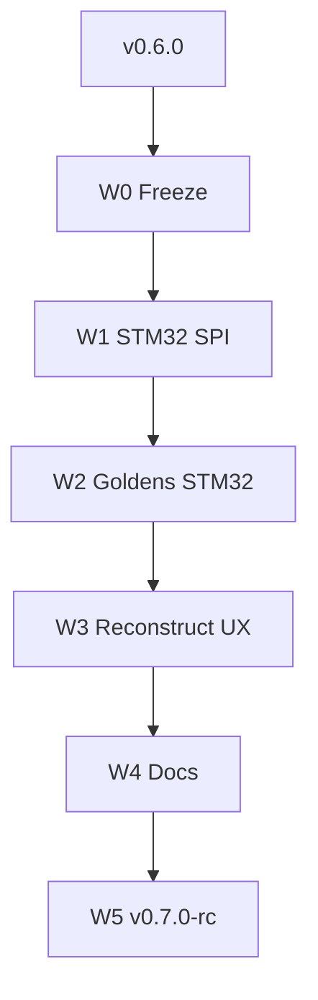

# 17 — Path to v0.7

> *v0.6 estável + STM32 multi-peripheral (SPI) opt-in + goldens no wedge — ainda consultoria.*

**Herdado de:** [[16 - Path to v0.6/16.00 - Index|Path to v0.6]] ✅ · tag git `v0.6.0`  
**Baseline de regressão:** `./examples/pilot/run.sh` + `./examples/pilot/run_t1_b2.sh` (+ `pilot_stm32` opt-in)

## Norte v0.7

| É | Não é |
|---|--------|
| SPI no wedge STM32 (opt-in, espelho T1 B2) | ASIC drop-in |
| Goldens event-graph / prove no path STM32 | PCB fabricável |
| Reconstruct/docs honesty | HIL production |
| Amiga/CD32 | wedge de release (pesquisa) |

## Mapa

| Nota | Papel |
|------|-------|
| [[17.01 - Master Plan\|Master Plan v0.7]] | Norte L16–L18, sprints W0–W5 |
| [[17.02 - Maturity Delta\|Maturity Delta]] | Deltas vs v0.6 |
| [[17.03 - Acceptance Criteria\|Acceptance]] | DoD |
| [[17.04 - Sprint Board\|Sprint Board]] | Kanban W0–W5 |

## Fluxo

## Princípio guia

1. **Não quebrar** `run.sh` / `run_t1_b2.sh`.
2. STM32 SPI = **opt-in** (não substitui USART smoke).
3. Amiga/CD32 permanece example de pesquisa.

[[16 - Path to v0.6/16.00 - Index]] ← Anterior · [[17.01 - Master Plan]] →
