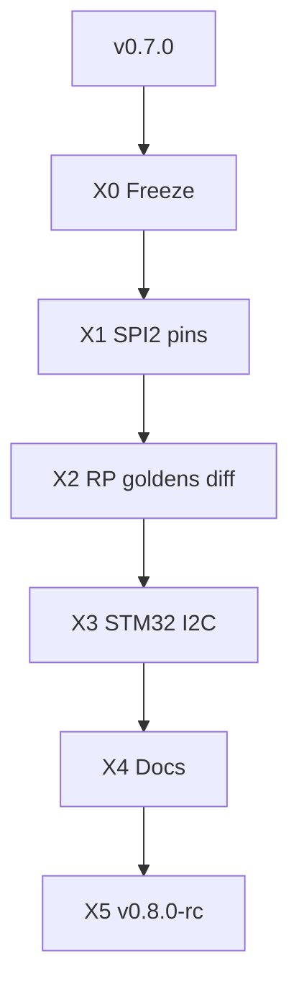

# 18 — Path to v0.8

> *v0.7 estável + pins SPI2 STM32 + goldens RP com `diff` + I2C opt-in — ainda consultoria.*

**Herdado de:** [[17 - Path to v0.7/17.00 - Index|Path to v0.7]] ✅ · tag git `v0.7.0`  
**Status:** Path to v0.8 **X0–X5 done** · tag git **`v0.8.0-rc`**.  
**Baseline de regressão:** `./examples/pilot/run.sh` + `./examples/pilot/run_t1_b2.sh` (+ `pilot_stm32` / `run_w1_spi.sh` / `run_x3_i2c.sh` opt-in)

## Norte v0.8

| É | Não é |
|---|--------|
| Pins SPI2 no draft sch STM32 | PCB fabricável |
| Goldens RP verificados (`diff`, ≠ overwrite) | ASIC drop-in |
| I2C STM32 opt-in (3º peripheral) | HIL production |
| Amiga/CD32 | wedge de release (pesquisa) |

## Mapa

| Nota | Papel |
|------|-------|
| [[18.01 - Master Plan\|Master Plan v0.8]] | Norte L19–L21, sprints X0–X5 |
| [[18.02 - Maturity Delta\|Maturity Delta]] | Deltas vs v0.7 |
| [[18.03 - Acceptance Criteria\|Acceptance]] | DoD |
| [[18.04 - Sprint Board\|Sprint Board]] | Kanban X0–X5 |
| [[18.20 - Forensic Playbook\|Playbook v0.8]] | Demo forense |
| [[18.21 - SOW Industrial Checklist\|SOW v0.8]] | Checklist industrial |

## Fluxo

## Princípio guia

1. **Não quebrar** `run.sh` / `run_t1_b2.sh` / `pilot_stm32` / `run_w1_spi.sh`.
2. Goldens = **verificar**, nunca sobrescrever no smoke.
3. Amiga/CD32 permanece example de pesquisa.

[[17 - Path to v0.7/17.00 - Index]] ← Anterior · [[18.01 - Master Plan]] →
