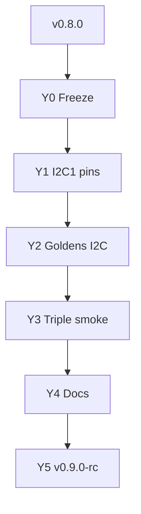

# 19 — Path to v0.9

> *v0.8 estável + pins I2C1 no draft STM32 + goldens I2C + smoke triplo USART/SPI/I2C — ainda consultoria.*

**Herdado de:** [[18 - Path to v0.8/18.00 - Index|Path to v0.8]] ✅ · tag git `v0.8.0`  
**Status:** Path to v0.9 **Y0–Y2 done** · Y3–Y5 em curso.  
**Baseline de regressão:** `./examples/pilot/run.sh` + `./examples/pilot/run_t1_b2.sh` (+ `pilot_stm32` / `run_w1_spi.sh` / `run_x3_i2c.sh` opt-in)

## Norte v0.9

| É | Não é |
|---|--------|
| Pins I2C1 no draft sch STM32 | PCB fabricável |
| Goldens I2C STM32 (`diff`) | ASIC drop-in |
| Smoke triplo USART+SPI2+I2C1 opt-in | HIL production |
| Amiga/CD32 | wedge de release (pesquisa) |

## Mapa

| Nota | Papel |
|------|-------|
| [[19.01 - Master Plan\|Master Plan v0.9]] | Norte L22–L24, sprints Y0–Y5 |
| [[19.02 - Maturity Delta\|Maturity Delta]] | Deltas vs v0.8 |
| [[19.03 - Acceptance Criteria\|Acceptance]] | DoD |
| [[19.04 - Sprint Board\|Sprint Board]] | Kanban Y0–Y5 |

## Fluxo

## Princípio guia

1. **Não quebrar** `run.sh` / `run_t1_b2.sh` / `pilot_stm32` / `run_w1_spi.sh` / `run_x3_i2c.sh`.
2. Goldens = **verificar**, nunca sobrescrever no smoke.
3. Amiga/CD32 permanece example de pesquisa.

[[18 - Path to v0.8/18.00 - Index]] ← Anterior · [[19.01 - Master Plan]] →
