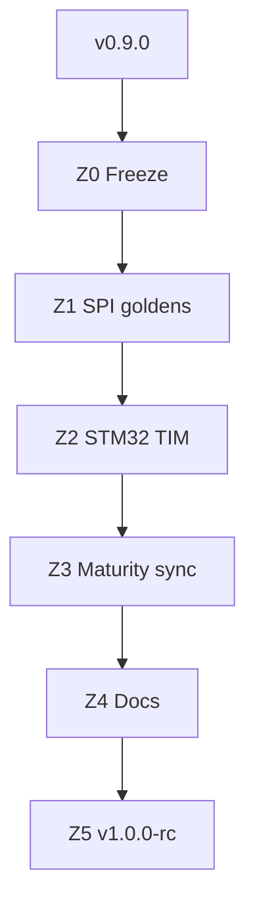

# 20 — Path to v1.0

> *v0.9 estável + goldens SPI STM32 + TIM2 opt-in + Maturity Matrix sync — ainda consultoria (≠ SaaS/ASIC).*

**Herdado de:** [[19 - Path to v0.9/19.00 - Index|Path to v0.9]] ✅ · tag git `v0.9.0`  
**Status:** Path to v1.0 **Z0–Z3 done** · Z4–Z5 em curso.  
**Baseline de regressão:** `./examples/pilot/run.sh` + `./examples/pilot/run_t1_b2.sh` (+ `pilot_stm32` / `run_w1_spi.sh` / `run_x3_i2c.sh` / `run_y3_triple.sh` / `run_z2_tim.sh` opt-in)

## Norte v1.0

| É | Não é |
|---|--------|
| Goldens SPI STM32 (`diff`) | PCB fabricável |
| TIM2 STM32 opt-in (4º tipo) | ASIC drop-in |
| Maturity Matrix alinhada ao wedge | HIL production / SaaS turnkey |
| Amiga/CD32 | wedge de release (pesquisa) |

## Mapa

| Nota | Papel |
|------|-------|
| [[20.01 - Master Plan\|Master Plan v1.0]] | Norte L25–L27, sprints Z0–Z5 |
| [[20.02 - Maturity Delta\|Maturity Delta]] | Deltas vs v0.9 |
| [[20.03 - Acceptance Criteria\|Acceptance]] | DoD |
| [[20.04 - Sprint Board\|Sprint Board]] | Kanban Z0–Z5 |

## Fluxo

## Princípio guia

1. **Não quebrar** gates RP + STM32 existentes (incl. `run_z2_tim.sh`).
2. Goldens = **verificar**, nunca sobrescrever no smoke.
3. v1.0 = milestone de **wedge forense auditável**, não claim de produto industrial completo.

[[19 - Path to v0.9/19.00 - Index]] ← Anterior · [[20.01 - Master Plan]] →
